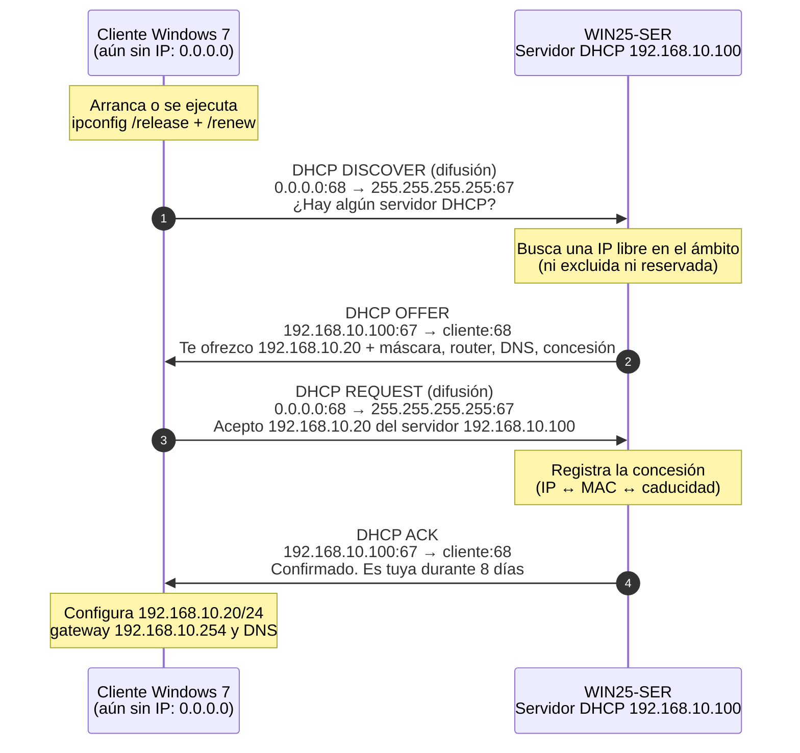
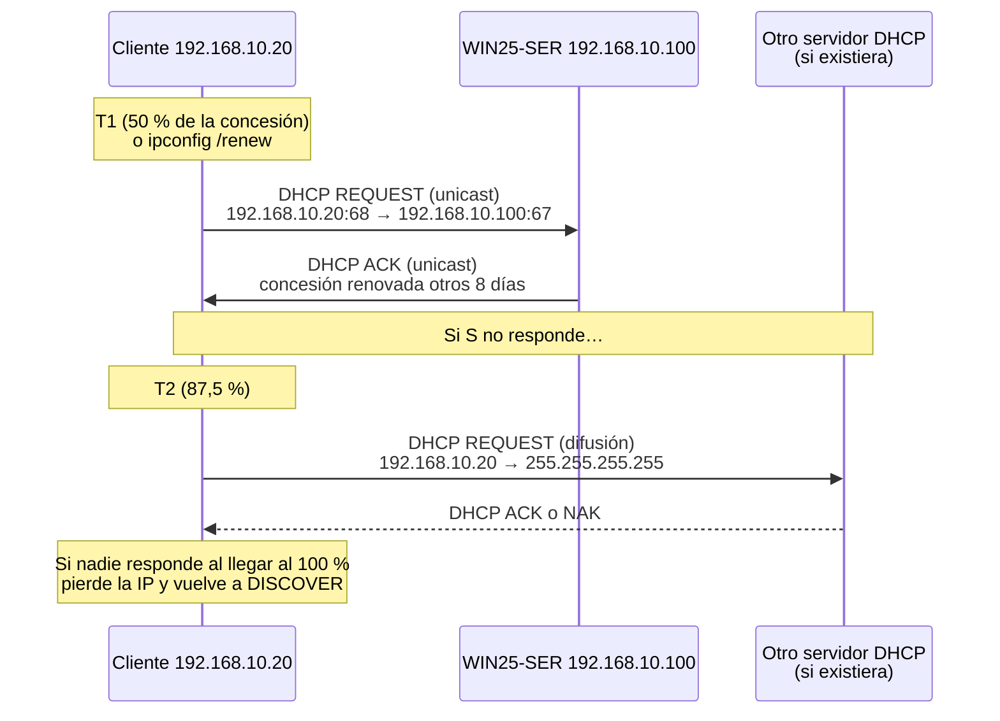
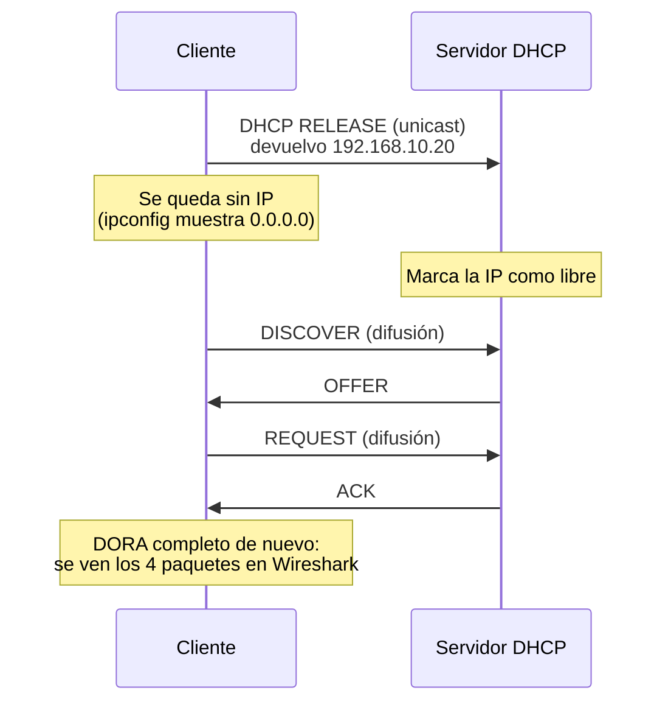
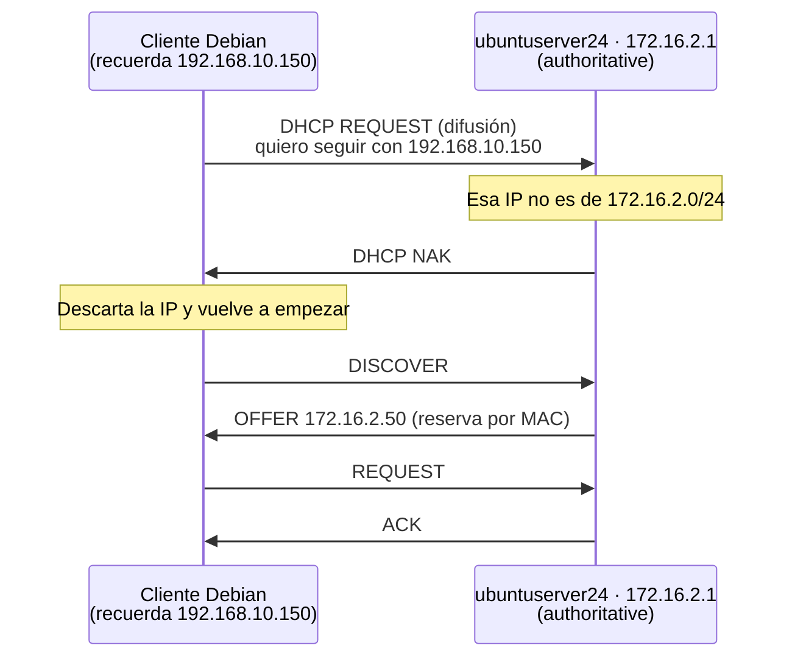
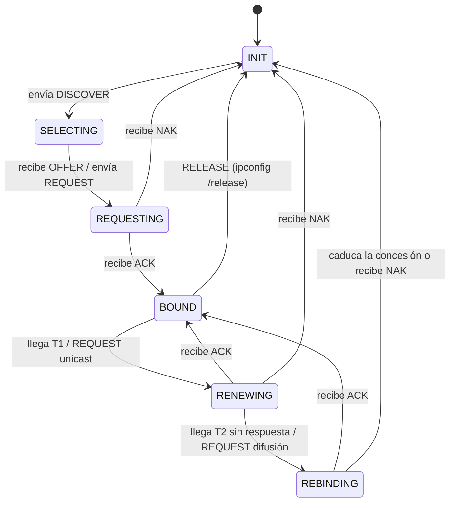

# Diagramas del proceso DHCP (DORA, renovación y liberación)

> **Ruta:** `recursos/ut1-dhcp/diagramas/dora.md`
> **UT1 · DHCP · RA1.a, RA1.c** · Diagramas en Mermaid (GitHub los muestra ya dibujados).
> Los datos son los de la práctica de Windows Server (red `net01`). En la de Ubuntu (`net02`) el proceso es el mismo; solo cambian las IP (servidor `ubuntuserver24`, `172.16.2.1`, gateway `172.16.2.254`).

---

## 1. Proceso DORA completo (obtener una IP por primera vez)

Cliente **Windows 7** sin IP y servidor **WIN25-SER** (`192.168.10.100`). La IP ofrecida (`192.168.10.20`) es un ejemplo: podría ser cualquiera libre del rango `.1` – `.50`.

### Contenido de cada mensaje

| # | Mensaje | Opción 53 (tipo) | IP origen → IP destino | Puertos UDP | ¿Difusión? | Datos importantes |
|---|---|---|---|---|---|---|
| 1 | **D**ISCOVER | 1 | `0.0.0.0` → `255.255.255.255` | 68 → 67 | Sí (MAC destino `ff:ff:ff:ff:ff:ff`) | MAC del cliente (`chaddr`), puede pedir su IP anterior (opción 50) |
| 2 | **O**FFER | 2 | `192.168.10.100` → difusión o IP ofrecida* | 67 → 68 | Depende del flag *broadcast* del cliente* | IP ofrecida (`yiaddr`), máscara (1), router (3), DNS (6), dominio (15), concesión (51), identificador del servidor (54) |
| 3 | **R**EQUEST | 3 | `0.0.0.0` → `255.255.255.255` | 68 → 67 | Sí | IP solicitada (opción 50) e identificador del servidor elegido (opción 54) |
| 4 | **A**CK | 5 | `192.168.10.100` → difusión o IP asignada* | 67 → 68 | Depende del flag *broadcast* del cliente* | Confirma la IP y todos los parámetros de la concesión |

\* Si el cliente activa el flag *broadcast* en su DISCOVER, el servidor responde por difusión; si no, responde en unicast a la MAC del cliente. Windows suele activarlo y `dhclient` de Linux normalmente no. En Wireshark se ve en `Bootp flags`.

> **¿Por qué el REQUEST va por difusión si el cliente ya sabe quién es el servidor?** Porque puede haber varios servidores DHCP que le hayan hecho una oferta. Enviándolo a todos, los servidores no elegidos (su opción 54 no coincide) liberan la IP que habían reservado para ese cliente.

**Otros mensajes:** `DHCPNAK` (6), el servidor rechaza la petición; `DHCPDECLINE` (4), el cliente detecta que la IP ya la usa otro equipo; `DHCPRELEASE` (7), el cliente devuelve la IP; `DHCPINFORM` (8), el cliente ya tiene IP y solo pide opciones.

---

## 2. Renovación de la concesión (T1 y T2)

El cliente no espera a que caduque la concesión. Con las duraciones de las prácticas:

| Momento | Windows Server (8 días) | Ubuntu Server (`default-lease-time 86400` = 1 día) | Qué hace el cliente |
|---|---|---|---|
| **T1** = 50 % | 4 días | 12 h | REQUEST en **unicast** a su servidor |
| **T2** = 87,5 % | 7 días | 21 h | REQUEST por **difusión** a cualquier servidor |
| 100 % | 8 días | 24 h | Pierde la IP y vuelve a empezar con DISCOVER |

---

## 3. Liberación y nueva solicitud (`ipconfig /release` + `/renew`)

Equivalencias en el cliente Debian: `sudo dhclient -r` (RELEASE) y `sudo dhclient -v` (DORA completo, mostrando cada mensaje en pantalla).

---

## 4. Caso NAK: el cliente pide una IP que no es de esta red

Ocurre, por ejemplo, si pasas el cliente Debian de `net01` a `net02` sin liberar la IP: al arrancar pide su IP anterior, `192.168.10.150`.

> Sin la directiva `authoritative;` en `dhcpd.conf`, el servidor **no respondería** a ese REQUEST y el cliente tardaría más en reaccionar (esperaría a que se agotaran los reintentos).

---

## 5. Estados del cliente DHCP (RFC 2131)

(Se han omitido los estados INIT-REBOOT y REBOOTING, que usa un cliente que arranca y ya recuerda una IP. Es el caso del apartado 4.)

---

## 6. Filtros de Wireshark útiles

| Filtro | Qué muestra |
|---|---|
| `dhcp` (o `bootp` en versiones antiguas) | Todos los mensajes DHCP |
| `udp.port == 67 or udp.port == 68` | Lo mismo, filtrando por puertos |
| `dhcp.option.dhcp == 1` | Solo DISCOVER (2 = OFFER, 3 = REQUEST, 5 = ACK, 6 = NAK, 7 = RELEASE) |
| `dhcp.hw.mac_addr == 08:00:27:aa:bb:cc` | Solo los mensajes de un cliente concreto (MAC ficticia de ejemplo) |
