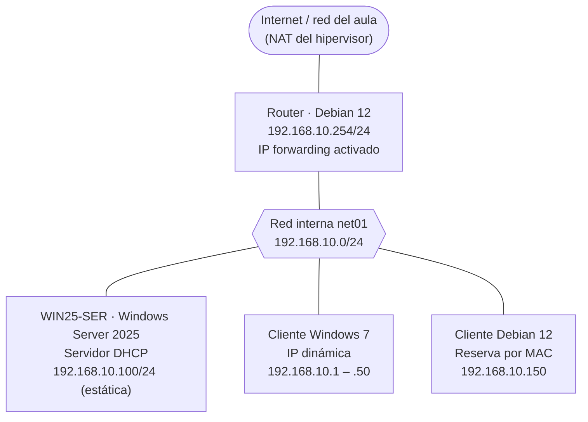
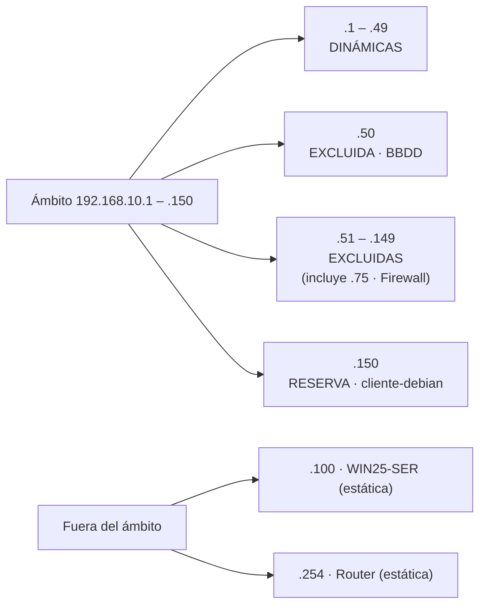
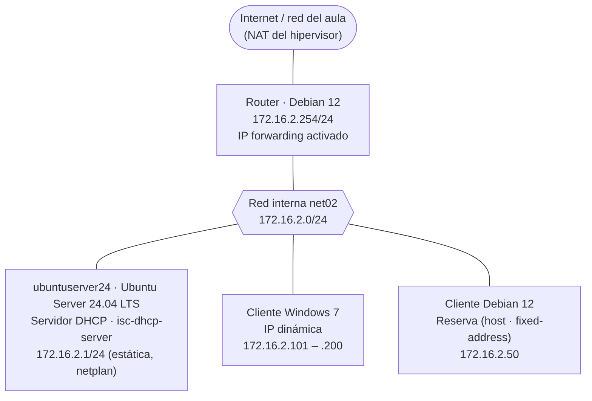
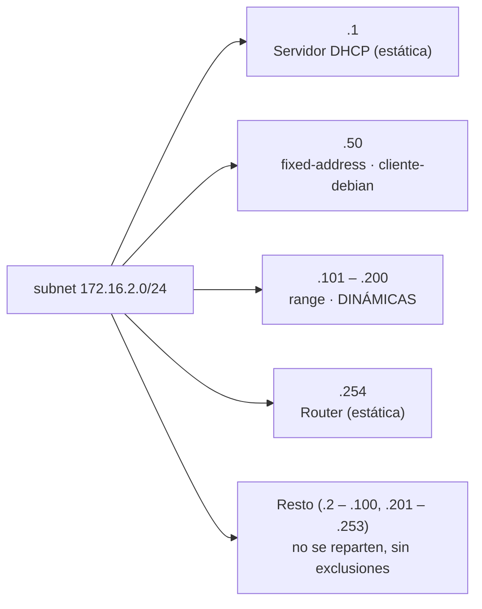

# Escenarios de red de la UT1 (DHCP)

> **Ruta:** `recursos/ut1-dhcp/diagramas/escenario-red.md`
> Fuente de los esquemas de `docs/ut1-dhcp/practica-windows.md` y `docs/ut1-dhcp/practica-ubuntu.md`. Cada escenario está en Mermaid (GitHub lo dibuja) y en ASCII (para copiar en Teams o en un examen).
> Las dos prácticas usan **redes internas distintas** (`net01` y `net02`), así que se pueden tener montadas a la vez sin que los dos servidores DHCP entren en conflicto.

---

## Escenario 1 · UT1-P1 · DHCP en Windows Server (`net01`)



**Reparto de direcciones del ámbito `smr2ser.org`**



> ⚠️ Ojo: `.100` (el propio servidor) está **dentro** del tramo excluido `.51`–`.149`, por eso no hay conflicto. Si alguien cambia las exclusiones, el servidor podría repartir su propia IP.

```text
                    Internet / red del aula (NAT)
                                 │
                   ┌─────────────┴─────────────┐
                   │   Router · Debian 12      │
                   │   192.168.10.254/24       │
                   └─────────────┬─────────────┘
                                 │
  ═══════════════════ net01 · 192.168.10.0/24 ══════════════════
          │                      │                      │
┌─────────┴─────────┐  ┌─────────┴─────────┐  ┌─────────┴─────────┐
│ WIN25-SER         │  │ Cliente Windows 7 │  │ Cliente Debian 12 │
│ Windows Server    │  │ DHCP dinámico     │  │ DHCP · reserva    │
│ 2025 · SERV. DHCP │  │ .1 – .50          │  │ por MAC           │
│ 192.168.10.100/24 │  │ (.1 – .49 tras    │  │ 192.168.10.150    │
│ (estática)        │  │  excluir .50)     │  │                   │
└───────────────────┘  └───────────────────┘  └───────────────────┘

Ámbito:      192.168.10.1 – 192.168.10.150   /24
Exclusiones: .51 – .149   ·   .50 (BBDD)   ·   (.75 Firewall: ya incluida)
Reserva:     .150 → cliente-debian (MAC)
Opciones:    003 Router 192.168.10.254 · 006 DNS 10.151.123.21, 10.151.126.21
             015 Dominio smr2ser.org
Concesión:   8 días
```

---

## Escenario 2 · UT1-P2 · DHCP en Ubuntu Server (`net02`)



**Reparto de direcciones de la subred**



```text
                    Internet / red del aula (NAT)
                                 │
                   ┌─────────────┴─────────────┐
                   │   Router · Debian 12      │
                   │   172.16.2.254/24         │
                   └─────────────┬─────────────┘
                                 │
  ═══════════════════ net02 · 172.16.2.0/24 ════════════════════
          │                      │                      │
┌─────────┴─────────┐  ┌─────────┴─────────┐  ┌─────────┴─────────┐
│ ubuntuserver24    │  │ Cliente Windows 7 │  │ Cliente Debian 12 │
│ Ubuntu 24.04 LTS  │  │ DHCP dinámico     │  │ DHCP · reserva    │
│ isc-dhcp-server   │  │ .101 – .200       │  │ fixed-address     │
│ 172.16.2.1/24     │  │                   │  │ 172.16.2.50       │
│ (estática, enp0s3)│  │                   │  │                   │
└───────────────────┘  └───────────────────┘  └───────────────────┘

subnet:      172.16.2.0 netmask 255.255.255.0
range:       172.16.2.101 – 172.16.2.200
host:        cliente-debian → 172.16.2.50 (hardware ethernet = MAC)
Opciones:    routers 172.16.2.254 · domain-name smr2ser.org
             domain-name-servers 10.151.123.21, 10.151.126.21
Concesión:   default 1 día · max 8 días · min 1 hora
```

---

## Equivalencias Windows Server ↔ isc-dhcp-server

| Concepto | Windows Server (consola DHCP) | isc-dhcp-server (`dhcpd.conf`) |
|---|---|---|
| Red que se atiende | Ámbito (*scope*) | `subnet … netmask … { }` |
| IP repartibles | Intervalo de direcciones | `range` |
| IP que no se reparten | Exclusiones | Basta con dejarlas fuera del `range` |
| IP fija para un equipo | Reserva (tiene que estar dentro del ámbito) | `host { hardware ethernet; fixed-address; }` (fuera del `range`) |
| Puerta de enlace | Opción 003 Enrutador | `option routers` |
| DNS | Opción 006 Servidores DNS | `option domain-name-servers` |
| Dominio | Opción 015 Nombre de dominio DNS | `option domain-name` |
| Duración de la concesión | Propiedades del ámbito | `default-lease-time`, `max-lease-time`, `min-lease-time` |
| Ver concesiones | Carpeta «Concesiones de direcciones» · `Get-DhcpServerv4Lease` | `/var/lib/dhcp/dhcpd.leases` (solo dinámicas) · `journalctl -u isc-dhcp-server` |
| Interfaz de escucha | Enlaces (IPv4 → Agregar o quitar enlaces) | `INTERFACESv4` en `/etc/default/isc-dhcp-server` |

## Hipervisor (VirtualBox)

| Máquina | Adaptador 1 | Adaptador 2 |
|---|---|---|
| Router Debian 12 | NAT (salida a Internet) | Red interna `net01` o `net02` |
| WIN25-SER | Red interna `net01` | — |
| ubuntuserver24 (Ubuntu Server 24.04 LTS) | Red interna `net02` | — |
| Cliente Windows 7 | Red interna `net01` o `net02`, según la práctica | — |
| Cliente Debian 12 | Red interna `net01` o `net02`, según la práctica | — |

> Si el router tiene que dar servicio a las dos prácticas a la vez, necesita un tercer adaptador (NAT + `net01` + `net02`). Si no, se cambia la red interna del adaptador 2 según la práctica. **No pongas ningún servidor DHCP en modo «Adaptador puente»:** repartiría IP en la red real del aula.
