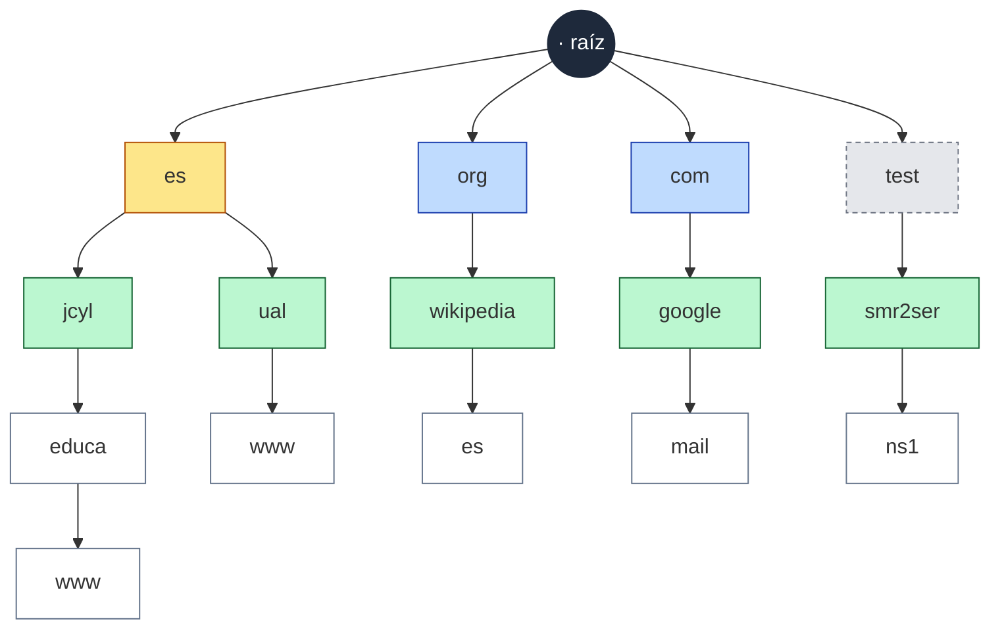

# UT2 · Actividad en el aula 2 · Localiza los niveles (solución)

> **Ruta:** `recursos/ut2-dns/diagramas/jerarquia-dns-actividad2.md`
> Solución de la «Actividad en el aula 2» de `docs/ut2-dns/teoria.md`. Está en `recursos/`, que **no se publica** en GitHub Pages: el alumnado no la ve hasta que la proyectes (desde github.com, que dibuja el Mermaid).
> **Criterio:** RA2.c (estructura, nomenclatura y funcionalidad de los sistemas de nombres jerárquicos).

## Dinámica propuesta (15–20 min)

1. **Por parejas, en el cuaderno (5 min):** separar cada nombre en etiquetas y leerlo **de derecha a izquierda**: `www.educa.jcyl.es.` → `.` · `es` · `jcyl` · `educa` · `www`.
2. **En la pizarra, entre todos (10 min):** dibujar **un único árbol** con la raíz arriba y colgar los cinco nombres. Al ir colgándolos salen solas las preguntas clave:
   - `www.educa.jcyl.es` y `www.ual.es` **comparten la rama `es`**: el árbol no se repite.
   - Hay **dos `www`** y **dos `es`** (uno es TLD y otro es un subdominio de Wikipedia), y no hay conflicto: cada uno está en una rama distinta.
   - ¿Dónde cuelga `test`? No es ni ccTLD ni gTLD.
3. **Proyectar este diagrama (5 min)** para comprobar y completar la tabla.

## Plantilla para la pizarra

```text
                              . (raíz)
          ┌─────────┬─────────┼─────────┬─────────┐
         ___       ___       ___       ___       ___        ← TLD
          │         │         │         │         │
         ___       ___       ___       ___       ___        ← 2º nivel
          │         │         │         │         │
         ___       ___       ___       ___       ___        ← 3er nivel / equipo
```

> Pista: no hacen falta cinco ramas en todos los niveles. Si dos nombres comparten TLD, cuelgan del mismo nodo.

## Solución: el árbol



**Leyenda:** ⬛ raíz · 🟨 ccTLD (país) · 🟦 gTLD (genérico) · ⬜ TLD reservado (borde discontinuo) · 🟩 dominio de 2º nivel · ⬜ 3er nivel / equipo

## Solución: la tabla

| Nombre | FQDN (con la raíz) | TLD | Tipo de TLD | Dominio de 2º nivel | Resto |
|---|---|---|---|---|---|
| `www.educa.jcyl.es` | `www.educa.jcyl.es.` | `es` | **ccTLD** (España, gestionado por Red.es) | `jcyl.es` | `educa` es un subdominio de 3er nivel; `www` es el equipo |
| `es.wikipedia.org` | `es.wikipedia.org.` | `org` | **gTLD** | `wikipedia.org` | `es` **no** es aquí un país: es un subdominio de Wikipedia |
| `mail.google.com` | `mail.google.com.` | `com` | **gTLD** | `google.com` | `mail` es el equipo/servicio |
| `www.ual.es` | `www.ual.es.` | `es` | **ccTLD** | `ual.es` | `www` es el equipo |
| `ns1.smr2ser.test` | `ns1.smr2ser.test.` | `test` | **Ninguno de los dos:** TLD **reservado** para pruebas (RFC 2606 / RFC 6761). No existe en Internet | `smr2ser.test` | `ns1` es nuestro servidor DNS |

## Preguntas para cerrar la actividad

1. ¿Por qué pueden existir dos equipos llamados `www` sin conflicto? *(Están en ramas distintas: sus FQDN son diferentes.)*
2. ¿Qué tienen en común `www.educa.jcyl.es` y `www.ual.es`? ¿Quién administra el nodo que comparten? *(El TLD `es`, que gestiona Red.es.)*
3. Si la Junta quiere crear `fp.educa.jcyl.es`, ¿tiene que comprarlo? *(No: los niveles por debajo del 2º los administra el propietario del dominio.)*
4. ¿Podrías comprar `smr2ser.test`? ¿Por qué lo usamos en clase? *(No, está reservado; así nunca chocará con un dominio real.)*
5. En `es.wikipedia.org`, ¿el `es` significa España? *(Indica el idioma de la Wikipedia, pero para el DNS es solo una etiqueta más.)*