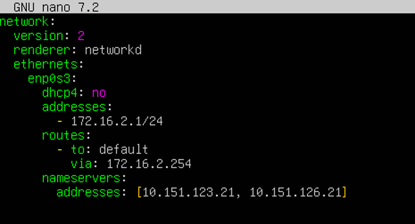

# Configuración manual de red en Ubuntu Server (Netplan)

Antes de instalar cualquier servicio (DHCP incluido), un servidor necesita una **dirección IP fija**: no tendría sentido que el propio servidor DHCP dependiera de otro servidor DHCP para tener IP. En Ubuntu Server, la red se gestiona con **Netplan**, y esta es la forma manual de configurarla.

> Usaremos esta misma guía para fijar la IP tanto del **Ubuntu Server** de la práctica de DHCP como de cualquier otra máquina Debian/Ubuntu que necesite una IP estática (por ejemplo, las interfaces del router).

## 1. Instalar la utilidad de red

`net-tools` no viene instalado por defecto en Ubuntu Server, y nos hará falta para comandos clásicos como `ifconfig` o `netstat`:

```bash
sudo apt install net-tools
```

## 2. Revisar las interfaces de red

Antes de tocar nada, identifica el nombre de tu interfaz de red (normalmente `enp0sX`) y su configuración actual:

```bash
ip address
```

## 3. Editar el fichero de configuración de red

Netplan guarda su configuración en `/etc/netplan/`. Antes de editar, haz siempre una copia de seguridad del fichero:

```bash
cd /etc/netplan
sudo cp 50-cloud-init.yaml bck_50-cloud-init.yaml
```

Edita el fichero original:

```bash
sudo nano /etc/netplan/50-cloud-init.yaml
```

Por defecto suele contener algo similar a esto (con `dhcp4: true`, es decir, IP dinámica):

```yaml
network:
  version: 2
  ethernets:
    enp0s3:
      dhcp4: true
```

Sustitúyelo por una configuración estática, con esta estructura:

```yaml
network:
  version: 2
  renderer: networkd
  ethernets:
    enp0s3:
      dhcp4: no
      addresses:
        - [dirección IP]/24
      routes:
        - to: default
          via: [dirección IP de la puerta de enlace]
      nameservers:
        addresses: [dirección IP del/de los DNS]
```

Por ejemplo, para el **Ubuntu Server de la práctica de DHCP** (`net02`, ver [práctica de Ubuntu](practica-ubuntu.md)):



```yaml
network:
  version: 2
  renderer: networkd
  ethernets:
    enp0s3:
      dhcp4: no
      addresses:
        - 172.16.2.1/24
      routes:
        - to: default
          via: 172.16.2.254
      nameservers:
        addresses: [10.151.123.21, 10.151.126.21]
```

> ⚠️ **Cuidado con la indentación.** YAML es muy estricto: usa siempre espacios (nunca tabuladores) y respeta los niveles de sangrado exactamente como en el ejemplo, o `netplan apply` fallará.

Guarda los cambios (`Ctrl+O`, `Enter`, `Ctrl+X` en `nano`).

## 4. Aplicar el cambio de red

```bash
sudo netplan apply
```

Si no aparece ningún mensaje de error, el cambio se ha aplicado correctamente.

## 5. Caso particular: la interfaz de un router con varios adaptadores

Si estás configurando una máquina con **varios adaptadores de red** (como el `debianRouter` de esta unidad, con NAT + dos redes internas — ver [Redes virtuales en VirtualBox](redes-virtualbox.md)), recuerda:

1. Antes de arrancar la máquina, comprueba en VirtualBox que cada adaptador está conectado al tipo de red correcto (**Red interna**, con el nombre exacto `net01`/`net02`, etc.).
2. Cada adaptador aparecerá como una interfaz distinta (`enp0s3`, `enp0s8`...) dentro de la propia máquina virtual — repite la configuración de Netplan añadiendo un bloque bajo `ethernets:` por cada interfaz que necesite IP fija.

## 6. Comprobar la configuración de red

```bash
ip a
```

Y verifica que hay conectividad con la puerta de enlace:

```bash
ping -c 3 [dirección IP de la puerta de enlace]
```

Si el `ping` responde correctamente, la configuración de red estática está lista para continuar con la instalación del servicio.

---

👉 Vuelve a la [teoría de DHCP](teoria.md), o continúa directamente con la [práctica de Ubuntu Server](practica-ubuntu.md).
