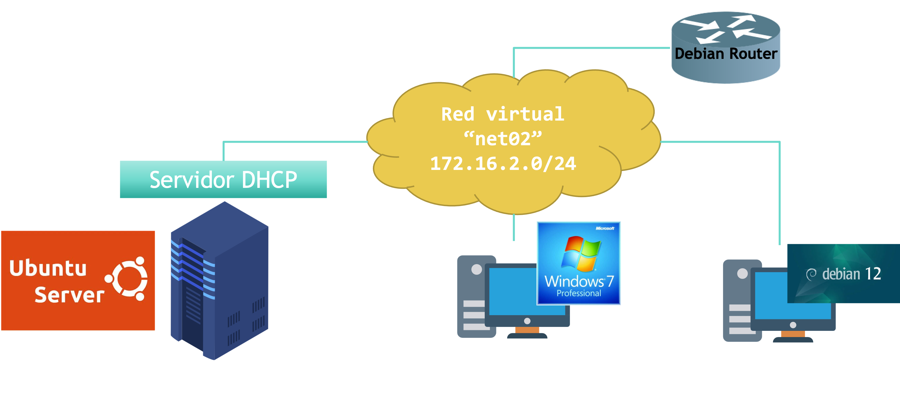

# Práctica: Instalación y configuración de DHCP en Ubuntu Server

## Arquitectura de red



| Equipo | Rol | Dirección IP |
|---|---|---|
| **Debian 12** | Router (puerta de enlace de `net02`) | `172.16.2.254` |
| **Ubuntu Server** | Servidor DHCP | `172.16.2.1` (estática) |
| **Cliente Windows 7** | Cliente con IP dinámica | Rango `172.16.2.101` – `172.16.2.200` |
| **Cliente Debian 12** | Cliente con IP reservada | Fija, vía reserva DHCP |

Todos los equipos comparten la misma red virtual interna **`net02`** (`172.16.2.0/24`). Nota que esta UT usa una red distinta de la de la práctica de Windows Server (`net01`, `192.168.10.0/24`): así podéis tener ambos entornos funcionando a la vez sin que los dos servidores DHCP entren en conflicto.

## Datos de configuración

| Parámetro | Valor |
|---|---|
| Dirección IP del servidor DHCP | `172.16.2.1` |
| Rango de IPs dinámicas | `172.16.2.101` – `172.16.2.200` |
| Máscara de subred | `255.255.255.0` |
| Puerta de enlace | `172.16.2.254` |
| Servidor DNS | *(IP del DNS de `educacyl`, o el que uses en tu centro)* |
| Nombre de dominio | `smr2ser.org` |
| Tiempo de concesión | 1 día (86 400 s) |
| Tiempo de concesión máximo | 8 días (691 200 s) |
| Tiempo de concesión mínimo | 1 hora (3 600 s) |

## Paso 0. Preparar la red virtual

1. Crea una red interna en el hipervisor llamada `net02`.
2. Conecta a ella las cuatro máquinas: el router Debian, el Ubuntu Server, el cliente Windows 7 y el cliente Debian 12.
3. Verifica que el router Debian tiene la IP `172.16.2.254/24` en su interfaz de `net02`, con reenvío de paquetes activado.
4. Asigna al Ubuntu Server la IP estática `172.16.2.1/24` (por ejemplo mediante Netplan). El servidor DHCP no puede autoasignarse su propia IP.

## Paso 1. Instalar el paquete (CE-d)

Inicia sesión en el Ubuntu Server y, desde el terminal:

```bash
sudo apt update
sudo apt install isc-dhcp-server
```

## Paso 2. Indicar en qué interfaz debe escuchar

Edita el fichero de interfaces del servicio:

```bash
sudo nano /etc/default/isc-dhcp-server
```

Comprueba/edita estas dos líneas:

```
# línea 4: descoméntala
DHCPDv4_CONF=/etc/dhcp/dhcpd.conf

# línea 17: especifica la interfaz que debe escuchar
INTERFACESv4="enp0s3"
```

> 📌 Sustituye `enp0s3` por el nombre real de tu interfaz de red conectada a `net02` (compruébalo con `ip a`).

## Paso 3. Configuración del servidor DHCP (CE-e, CE-g)

Edita el fichero principal de configuración:

```bash
sudo nano /etc/dhcp/dhcpd.conf
```

Localiza y edita estas directivas:

```conf
# línea 10: nombre del dominio
option domain-name "smr2ser.org";

# línea 11: hostname del DNS o su IP
option domain-name-servers educacyl;

# líneas 13, 14 y 15: tiempos de concesión (en segundos)
default-lease-time 86400;
max-lease-time 691200;
min-lease-time 3600;

# línea 25: descoméntala para que este servidor DHCP sea válido en la red
authoritative;
```

Y añade al final del fichero el bloque de subred:

```conf
# dirección de red y máscara de subred
subnet 172.16.2.0 netmask 255.255.255.0 {
    # gateway
    option routers 172.16.2.254;
    # máscara de subred
    option subnet-mask 255.255.255.0;
    # rango de direcciones IP
    range 172.16.2.101 172.16.2.200;
}
```

**Explicación de cada directiva:**

| Directiva | Qué hace |
|---|---|
| `option domain-name` | Dominio DNS que se asigna a los clientes. |
| `option domain-name-servers` | Servidor(es) DNS que usarán los clientes. |
| `default-lease-time` | Duración de la concesión si el cliente no pide otra. |
| `max-lease-time` | Duración máxima permitida de la concesión. |
| `min-lease-time` | Duración mínima permitida de la concesión. |
| `authoritative` | Indica que este servidor es la autoridad DHCP de la red: si detecta clientes con configuraciones incorrectas, les envía un `DHCPNAK` en vez de ignorarlos. |
| `range` | Rango de IPs que se reparten dinámicamente. |

## Paso 4. Reiniciar y comprobar el servicio (CE-d)

```bash
sudo systemctl restart isc-dhcp-server
sudo systemctl status isc-dhcp-server
```

Verifica que el proceso está en ejecución:

```bash
ps -ef | grep dhcp
```

Comprueba que el servidor escucha en el puerto UDP 67:

```bash
sudo netstat -ltun | grep 67
```

> Si `netstat` no está disponible, instala el paquete `net-tools` (`sudo apt install net-tools`) o usa el equivalente `sudo ss -ltun | grep 67`.

## Paso 5. Asignación estática mediante reserva — cliente Debian (CE-f)

Aunque el rango dinámico solo cubre `.101`–`.200`, en `isc-dhcp-server` **una reserva puede declararse con cualquier IP de la subred, esté o no dentro del `range`**. Añade este bloque dentro (o fuera, a tu elección) del `subnet { }`:

```conf
host cliente-debian {
    hardware ethernet 08:00:27:AA:BB:CC;
    fixed-address 172.16.2.50;
}
```

> 🔎 Sustituye la MAC por la real del cliente Debian (consíguela con `ip a` en el propio cliente). Como `172.16.2.50` está fuera del rango `.101`–`.200`, no hace falta declarar ninguna exclusión: `isc-dhcp-server` simplemente la reserva para ese host sin necesidad de que forme parte del `range` dinámico.

Reinicia el servicio para aplicar el cambio:

```bash
sudo systemctl restart isc-dhcp-server
```

## Paso 6. Clientes DHCP y verificación de concesiones (CE-h)

**Cliente Windows 7** (asignación dinámica, dentro de `net02`):

```cmd
ipconfig /release
ipconfig /renew
ipconfig /all
```

Confirma que recibe una IP dentro de `172.16.2.101`–`.200`, junto con la puerta de enlace `172.16.2.254` y el DNS configurado.

**Cliente Debian 12** (asignación estática vía reserva):

```bash
ip a                 # comprueba la MAC de la interfaz (antes de configurar la reserva)
sudo dhclient -r
sudo dhclient -v
ip a                  # comprueba que ha recibido 172.16.2.50
```

**Comprobaciones a realizar en el servidor:**

Revisa el fichero de concesiones para confirmar ambas asignaciones:

```bash
cat /var/lib/dhcp/dhcpd.leases
```

Deberías ver una entrada de concesión dinámica para el cliente Windows 7 (dentro del rango `.101`–`.200`) y una entrada fija para el cliente Debian (`172.16.2.50`).

**Comprobaciones a realizar:**

- [ ] El cliente Windows 7 recibe una IP dentro de `172.16.2.101`–`.200`.
- [ ] El cliente Debian recibe siempre `172.16.2.50`.
- [ ] Ambos clientes reciben correctamente la puerta de enlace y el DNS.
- [ ] `dhcpd.leases` refleja ambas concesiones.

## Paso 7. Captura del proceso DORA con Wireshark (opcional, refuerza CE-c)

1. Abre Wireshark en el servidor o en un equipo conectado al mismo segmento.
2. Filtra por `bootp` (o `dhcp` según versión).
3. Libera/renueva la IP del cliente Windows 7 y observa los 4 paquetes: `DHCP Discover → Offer → Request → ACK`.

---

## Tarea de entrega (Microsoft Teams)

Adjunta a la tarea de Teams:

- Captura de `dhcpd.conf` final.
- Captura de la salida de `systemctl status isc-dhcp-server`.
- Captura de `ps -ef | grep dhcp` y de la comprobación del puerto 67 (`netstat`/`ss`).
- Captura de `ipconfig /all` (cliente Windows 7) mostrando la IP dinámica recibida.
- Captura de `ip a` (cliente Debian) mostrando la IP reservada `172.16.2.50`.
- Captura del fichero `dhcpd.leases` con ambas concesiones.
- (Opcional) Captura de Wireshark con el proceso DORA.

## Comparación con la práctica de Windows Server

Una vez completadas ambas prácticas, reflexiona sobre estas preguntas (te servirán para consolidar el CE-a y CE-b):

- ¿Qué pasos son conceptualmente los mismos en `isc-dhcp-server` y en Windows Server, aunque cambien de nombre (subnet ↔ ámbito, host ↔ reserva, etc.)?
- En la práctica de Windows Server, una reserva debe pertenecer al rango de direcciones del ámbito, lo que obligó a definir una exclusión intermedia. Aquí, en cambio, has podido reservar `172.16.2.50` sin que estuviera dentro del `range 172.16.2.101 172.16.2.200`. ¿Qué ventaja o inconveniente le ves a cada enfoque?
- ¿Qué diferencia de tráfico genera renovar una concesión (`dhclient` contactando con el mismo servidor) frente a liberarla y pedir una nueva (`dhclient -r` + `dhclient`)? Relaciónalo con el proceso DORA visto en la teoría.
- ¿Qué te ha resultado más rápido de configurar en cada sistema: el reparto dinámico, las opciones adicionales (DNS, gateway) o las reservas estáticas?