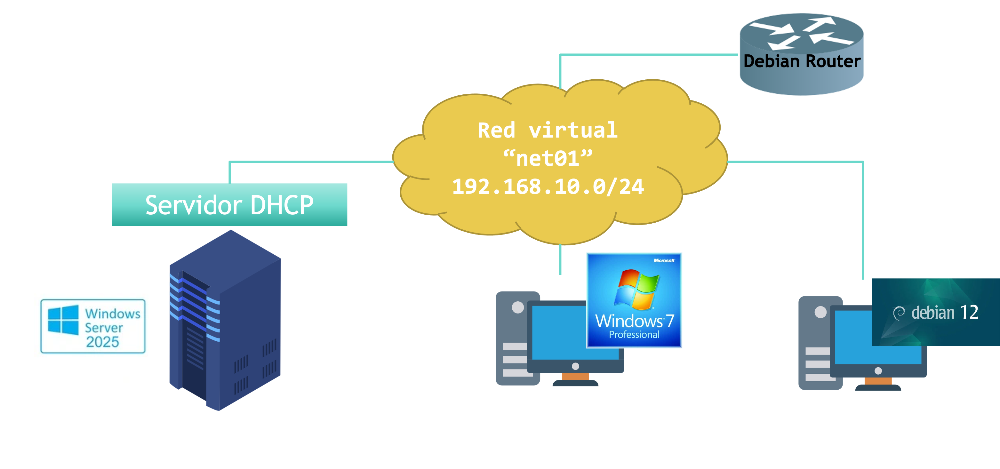

# Práctica: Instalación y configuración de DHCP en Windows Server

## Arquitectura de red



| Equipo | Rol | Dirección IP |
|---|---|---|
| **Debian 12** | Router (puerta de enlace de `net01`) | `192.168.10.254` |
| **Windows Server 2025** | Servidor DHCP | `192.168.10.100` (estática) |
| **Cliente Windows 7** | Cliente con IP dinámica | Rango `192.168.10.1` – `192.168.10.50` |
| **Cliente Debian 12** | Cliente con IP reservada | `192.168.10.150` (fija, vía reserva DHCP) |

Todos los equipos comparten la misma red virtual interna **`net01`** (`192.168.10.0/24`).

> 📌 Se asume que el router Debian ya está operativo, con reenvío de paquetes (*IP forwarding*) activado y su interfaz en `net01` configurada con `192.168.10.254/24`. Este montaje del router se detalla en profundidad en la UT7 (interconexión de redes); aquí solo lo usamos como puerta de enlace y salida a Internet para las actualizaciones.

## Paso 0. Preparar la red virtual

1. Crea una red interna en el hipervisor llamada `net01`.
2. Conecta a esa red las cuatro máquinas: el router Debian, el Windows Server, el cliente Windows 7 y el cliente Debian 12.
3. Verifica que el router Debian tiene la IP `192.168.10.254/24` en su interfaz de `net01` y reenvío de paquetes activado (`sysctl net.ipv4.ip_forward`).

## Paso 1. Cambiar el nombre del host del servidor (CE-d)

Antes de instalar el rol, es recomendable identificar bien el servidor cambiando su nombre por defecto:

1. **Configuración → Sistema → Cambiar nombre**.
2. Sustituye el nombre autogenerado (tipo `WIN-P6RO9O3FG9`) por algo identificable, por ejemplo **`WIN25-SER`**.
3. Reinicia para aplicar el cambio.

## Paso 2. Configurar la red estática del servidor (CE-e)

El servidor DHCP necesita él mismo una IP fija (no puede autoasignársela con DHCP):

1. **Configuración → Red e Internet → [tu adaptador] → Editar configuración de IP → Manual**.
2. Configura:

| Campo | Valor |
|---|---|
| Dirección IP | `192.168.10.100` |
| Máscara de subred | `255.255.255.0` |
| Puerta de enlace | `192.168.10.254` |
| DNS preferido | *(IP de tu servidor DNS; si aún no tienes uno propio, usa uno externo como `8.8.8.8` para las prácticas)* |

## Paso 3. Instalar el rol DHCP Server (CE-d)

1. Abre el **Administrador del servidor**.
2. **Administrar → Agregar roles y características**.
3. Avanza el asistente hasta **Roles de servidor** y marca **Servidor DHCP**.
4. Acepta las características adicionales que proponga el asistente y completa la instalación.
5. Al terminar, completa la **configuración de DHCP** posinstalación (autorización del servidor). En un entorno sin dominio de Active Directory, este paso puede quedar simplificado o no ser necesario.

## Paso 4. Crear el ámbito (CE-e, CE-g)

1. Abre la consola **DHCP**: **Herramientas administrativas → DHCP** (o `dhcpmgmt.msc`).
2. En el árbol de la izquierda, sobre tu servidor, comprueba que el nodo **IPv4** está enlazado a la interfaz de red correcta (**Agregar o quitar enlaces**, si hiciera falta).
3. Clic derecho en **IPv4 → Ámbito nuevo...** e introduce estos datos en el asistente:

| Página del asistente | Valor |
|---|---|
| Nombre del ámbito | `smr2ser.org` (o el nombre que prefieras) |
| Intervalo de direcciones IP | Inicial: `192.168.10.1` — Final: `192.168.10.150` |
| Máscara de subred | `255.255.255.0` (longitud 24) |
| Exclusiones | `192.168.10.51` a `192.168.10.149` |
| Duración de la concesión | Valor por defecto (8 días), o redúcelo para las pruebas |
| Enrutador (puerta de enlace) | `192.168.10.254` |
| Dominio y servidores DNS | Dominio primario y dirección(es) IP del servidor DNS |

> ⚠️ **Por qué el rango llega hasta `.150` con una exclusión intermedia:** el cliente Debian necesita una **reserva** en `192.168.10.150`, pero en Windows Server una reserva debe pertenecer al rango de direcciones del ámbito. Como solo queremos repartir direcciones **dinámicas** entre `.1` y `.50`, definimos el ámbito hasta `.150` y excluimos el tramo intermedio (`.51`–`.149`) del reparto automático. Así, `.150` queda "libre" dentro del ámbito, disponible únicamente para la reserva del Paso 5.

4. Finaliza el asistente y **activa** el ámbito si no se activa automáticamente (clic derecho sobre el ámbito → **Activar**).

## Paso 5. Reservar la IP del cliente Debian (CE-f)

1. En la consola DHCP, dentro del ámbito, abre la carpeta **Reservas**.
2. Clic derecho → **Reserva nueva...**
3. Completa:
   - **Nombre de la reserva:** `cliente-debian`
   - **Dirección IP:** `192.168.10.150`
   - **Dirección MAC:** la de la tarjeta de red del cliente Debian (consíguela con `ip a` o `ip link` en el propio cliente, buscando la línea `link/ether`).
   - **Tipos compatibles:** deja "Ambos" (DHCP y BOOTP) salvo que quieras restringirlo.
4. Acepta. A partir de ahora, el cliente Debian recibirá siempre `192.168.10.150` cuando solicite una IP por DHCP.

## Paso 6. Permitir el ping al servidor en el Firewall (verificación)

Por defecto, el Firewall de Windows bloquea las peticiones ICMP entrantes, lo que dificulta comprobar la conectividad desde los clientes:

1. **Firewall de Windows Defender con seguridad avanzada → Reglas de entrada → Nueva regla...**
2. Tipo de regla: **Personalizada**.
3. Protocolo y puertos: tipo de protocolo **ICMPv4**.
4. Ámbito, acción y perfil: deja los valores por defecto (permitir la conexión, todos los perfiles) salvo que tu escenario requiera restringirlo.
5. Nombre: `Habilitar PING a Windows Server`.

## Paso 7. Verificación desde el cliente Windows 7 — asignación dinámica (CE-h)

Desde una consola (`cmd`) en el cliente Windows 7:

```cmd
ipconfig /all
```

Confirma que ha recibido una IP dentro del rango `192.168.10.1`–`.50`, la puerta de enlace `192.168.10.254` y el DNS configurado.

Prueba después estos dos comportamientos, y compáralos:

| Comando | Qué ocurre |
|---|---|
| `ipconfig /renew` | Intenta **renovar** la IP contactando directamente con el mismo servidor DHCP del que la obtuvo. Genera tráfico **unicast**. Si ese servidor ya no puede ofrecérsela, el cliente se queda sin IP. |
| `ipconfig /release` seguido de `ipconfig /renew` | El primero **libera** la IP actual (el cliente queda con `0.0.0.0`); el segundo solicita una nueva a **cualquier** servidor DHCP disponible. Genera tráfico **broadcast** (es, de hecho, un nuevo proceso DORA completo). |

## Paso 8. Verificación desde el cliente Debian — reserva (CE-h)

```bash
ip a                 # comprueba la MAC de la interfaz (antes de configurar la reserva)
sudo dhclient -r      # libera la IP actual, si tenía
sudo dhclient -v      # solicita una nueva por DHCP, en modo detallado
ip a                  # comprueba que ha recibido 192.168.10.150
```

**Comprobaciones a realizar:**

- [ ] El cliente Windows 7 recibe una IP dentro de `192.168.10.1`–`.50`.
- [ ] El cliente Debian recibe **siempre** `192.168.10.150`.
- [ ] Ambos clientes reciben correctamente la puerta de enlace (`192.168.10.254`) y el DNS configurado.
- [ ] En la consola DHCP, la carpeta **Concesiones de direcciones** muestra ambas asignaciones activas, con su MAC y nombre de host.
- [ ] El comando `ping 192.168.10.100` funciona desde ambos clientes (gracias a la regla de firewall del Paso 6).

## Paso 9. Captura del proceso DORA con Wireshark (opcional, refuerza CE-c)

1. Abre Wireshark en el servidor o en un equipo conectado a `net01`.
2. Filtra por `bootp` (o `dhcp`).
3. Ejecuta `ipconfig /release` + `ipconfig /renew` en el cliente Windows 7 (esto sí genera broadcast) y observa los 4 paquetes: `DHCP Discover → Offer → Request → ACK`.

---

## Tarea de entrega (Microsoft Teams)

La entrega de esta práctica se gestiona como tarea en Microsoft Teams. Antes de entregar, completa además las siguientes actividades:

### Configuración adicional del ámbito

Añade las siguientes exclusiones en el ámbito, reservando esas direcciones para servidores que se desplegarán más adelante (aún no es necesario instalarlos, solo reservar su IP):

| IP excluida | Uso futuro |
|---|---|
| `192.168.10.50` | Servidor de BBDD |
| `192.168.10.75` | Firewall |

> 📌 Ten en cuenta que `192.168.10.50` formaba parte del rango dinámico (`.1`–`.50`) definido en el Paso 4. Al excluirla, el reparto dinámico real para el cliente Windows 7 queda en `.1`–`.49`.

### Verificaciones a realizar

- Realiza diferentes comprobaciones con los equipos cliente (Windows 7 y Debian) y con el servidor, para comprobar las concesiones realizadas: qué IP tiene cada uno, desde cuándo, y hasta cuándo dura su concesión.

### Evidencias a entregar

Adjunta a la tarea de Teams:

- Captura del cambio de nombre de host y de la configuración de red estática del servidor.
- Captura del asistente de creación del ámbito (rango, exclusión, router, DNS).
- Captura de las dos exclusiones añadidas (BBDD y Firewall).
- Captura de la reserva creada para el cliente Debian (IP + MAC).
- Captura de la regla de firewall para ICMP.
- Captura de `ipconfig /all` en el cliente Windows 7, mostrando la IP dinámica recibida.
- Captura de `ip a` en el cliente Debian, mostrando la IP `192.168.10.150`.
- Captura de la consola DHCP con ambas concesiones activas (**Concesiones de direcciones**), mostrando IP, nombre de host y tiempo de expiración de cada una.
- (Opcional) Captura de Wireshark con el proceso DORA.