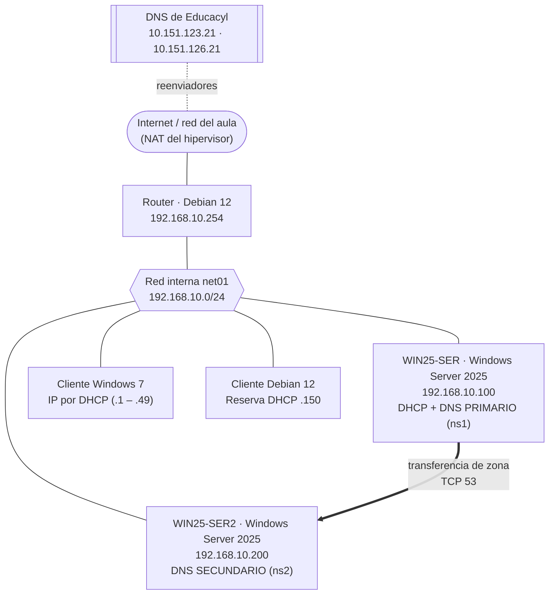

# UT2-P1 · Servidor DNS en Windows Server 2025

> **Módulo:** Servicios en Red · 2º SMR · **RA2:** Instala servicios de resolución de nombres, describiendo sus características y aplicaciones.
> **Duración orientativa:** 3 sesiones de 2 h (Parte A: pasos 1–6 · Parte B: pasos 7–10 · Parte C: pasos 11–15)
> [← Volver a la portada de la UT2](index.md) · [Teoría del servicio DNS](teoria.md)

---

## 1. Objetivo y criterios de evaluación

Instalar y configurar el rol **Servidor DNS** en el mismo `WIN25-SER` de la práctica de DHCP, para que sea el servidor de nombres de la red `net01`:

- **Primario** de la zona directa `smr2ser.test` y de la zona inversa `10.168.192.in-addr.arpa`.
- **Caché y reenviador** hacia los DNS de Educacyl, para que los equipos de la red puedan resolver nombres de Internet.
- Con un **servidor secundario**, `WIN25-SER2`, que recibe una copia de la zona mediante **transferencia de zona**.

| Criterio | Qué se hace en esta práctica | Pasos |
|---|---|---|
| **RA2.d** | Instalar un servicio jerárquico de resolución de nombres | 2, 3, 4 |
| **RA2.e** | Preparar el servicio para almacenar las respuestas de servidores públicos y servirlas a la red local (caché + reenviadores) | 8 |
| **RA2.f** | Añadir registros a una zona nueva, con opciones de correo (MX) y alias (CNAME) | 5, 6, 7 |
| **RA2.g** | Realizar transferencias de zona entre dos servidores | 11 – 15 |
| **RA2.h** | Comprobar el funcionamiento correcto del servidor | 10, 15 y apartado 5 |

---

## 2. Escenario

Es el mismo escenario de la UT1 (red interna `net01`), con dos cambios: `WIN25-SER` pasa a ser también servidor DNS y se añade un segundo servidor, `WIN25-SER2`.



```text
                      Internet / red del aula (NAT)  ←  DNS Educacyl 10.151.123.21 / .126.21
                                   │
                     ┌─────────────┴─────────────┐
                     │  Router · Debian 12       │
                     │  192.168.10.254           │
                     └─────────────┬─────────────┘
  ═════════════════════════ net01 · 192.168.10.0/24 ═════════════════════════
         │                    │                    │                    │
┌────────┴────────┐ ┌─────────┴───────┐ ┌──────────┴──────┐ ┌───────────┴─────┐
│ WIN25-SER       │ │ WIN25-SER2      │ │ Cliente Win 7   │ │ Cliente Debian  │
│ 192.168.10.100  │ │ 192.168.10.200  │ │ DHCP (.1 – .49) │ │ DHCP · reserva  │
│ DHCP            │ │ DNS secundario  │ │                 │ │ 192.168.10.150  │
│ DNS primario    │ │ (ns2)           │ │                 │ │                 │
│ (ns1)           │ │                 │ │                 │ │                 │
└─────────────────┘ └─────────────────┘ └─────────────────┘ └─────────────────┘
        │  ══ transferencia de zona (AXFR/IXFR, TCP 53) ══▶  │
```

**Datos de la práctica**

| Dato | Valor |
|---|---|
| Zona directa | `smr2ser.test` (fichero `smr2ser.test.dns`) |
| Zona inversa | `10.168.192.in-addr.arpa` (fichero `10.168.192.in-addr.arpa.dns`) |
| Servidor principal (SOA) | `ns1.smr2ser.test.` |
| Persona responsable (SOA) | `admin.smr2ser.test.` (= `admin@smr2ser.test`) |
| Servidores de nombres (NS) | `ns1.smr2ser.test.` (192.168.10.100) · `ns2.smr2ser.test.` (192.168.10.200) |
| Reenviadores | `10.151.123.21` · `10.151.126.21` (DNS de Educacyl) |
| Actualizaciones dinámicas | No |

**Registros que vamos a crear** (son los mismos del ejemplo del apartado 7 de la [teoría](teoria.md)):

| Nombre | Tipo | Valor | ¿Crear PTR? | Para qué |
|---|---|---|---|---|
| `win25-ser` | A | 192.168.10.100 | ✅ Sí | Nombre real del servidor primario |
| `win25-ser2` | A | 192.168.10.200 | ✅ Sí | Nombre real del servidor secundario |
| `router` | A | 192.168.10.254 | ✅ Sí | Puerta de enlace |
| `debiancli` | A | 192.168.10.150 | ✅ Sí | Cliente Debian (tiene reserva DHCP) |
| `ns1` | A | 192.168.10.100 | ❌ No | Servidor de nombres primario |
| `ns2` | A | 192.168.10.200 | ❌ No | Servidor de nombres secundario |
| `www` | A | 192.168.10.100 | ❌ No | Servidor web (UT6) |
| `mail` | A | 192.168.10.100 | ❌ No | Servidor de correo (UT5) |
| `web` | CNAME | `www.smr2ser.test.` | — | Alias de `www` |
| `ftp` | CNAME | `win25-ser.smr2ser.test.` | — | Alias del servidor FTP (UT4) |
| `(igual que la carpeta principal)` | MX | `10 mail.smr2ser.test.` | — | Correo de `@smr2ser.test` |

> **¿Por qué no se crea PTR para `ns1`, `www` o `mail`?** Comparten IP con `win25-ser`. Una IP debe tener **un solo PTR**, con el nombre principal del equipo. Si marcas la casilla en todos, la `.100` tendría cuatro nombres inversos.

**Hipervisor (VirtualBox)**

| Máquina | Adaptador 1 | Adaptador 2 |
|---|---|---|
| Router Debian 12 | NAT | Red interna `net01` |
| WIN25-SER | Red interna `net01` | — |
| WIN25-SER2 (clon) | Red interna `net01` | — |
| Cliente Windows 7 | Red interna `net01` | — |
| Cliente Debian 12 | Red interna `net01` | — |

---

## 3. Requisitos previos

- [ ] Práctica **UT1-P1** terminada: `WIN25-SER` con IP `192.168.10.100/24`, puerta de enlace `192.168.10.254` y el servicio DHCP funcionando.
- [ ] Router Debian 12 encendido y dando salida a Internet (desde `WIN25-SER`, `ping 10.151.123.21` debe responder).
- [ ] Clientes Windows 7 y Debian 12 recibiendo IP por DHCP (el Debian, la `.150`).
- [ ] **Instantánea** de `WIN25-SER` antes de empezar: *Máquina → Tomar instantánea* → nombre `UT1-fin-DHCP`.
- [ ] Espacio en disco para un clon completo de `WIN25-SER` (Parte C).
- [ ] En el cliente Debian, herramienta `dig`: `sudo apt install dnsutils` (con el router dando salida).

---

## 4. Pasos

### Parte A · Instalación y zonas (sesión 1)

#### Paso 1 · Comprobar el punto de partida

En `WIN25-SER`, abre PowerShell como Administrador:

```powershell
hostname                                  # Debe ser WIN25-SER
Get-NetIPConfiguration                    # IPv4Address 192.168.10.100 · Gateway 192.168.10.254
Get-Service DHCPServer                    # Status: Running
```

**Resultado esperado:** nombre, IP y DHCP como al final de la UT1. Si algo no coincide, corrígelo antes de seguir.

#### Paso 2 · Instalar el rol Servidor DNS · RA2.d

1. *Administrador del servidor → Administrar → Agregar roles y características*.
2. *Instalación basada en características o roles* → servidor `WIN25-SER`.
3. Marca **Servidor DNS** → *Agregar características* (herramientas de administración) → *Siguiente* hasta *Instalar*.
4. Al terminar, en *Herramientas* aparece **DNS** (consola *Administrador de DNS*, `dnsmgmt.msc`).

```powershell
Install-WindowsFeature -Name DNS -IncludeManagementTools
Get-Service DNS                           # Status: Running
```

> No hace falta reiniciar. La instalación del rol activa las reglas del firewall para el puerto 53 (UDP y TCP).

#### Paso 3 · Crear la zona de búsqueda directa `smr2ser.test` · RA2.d

En *Administrador de DNS*: clic derecho sobre **Zonas de búsqueda directa → Zona nueva…**

| Pantalla del asistente | Opción |
|---|---|
| Tipo de zona | **Zona principal** (sin marcar «Almacenar la zona en Active Directory»: no tenemos dominio) |
| Nombre de zona | `smr2ser.test` |
| Archivo de zona | **Crear un archivo nuevo con este nombre:** `smr2ser.test.dns` |
| Actualización dinámica | **No admitir actualizaciones dinámicas** |

```powershell
Add-DnsServerPrimaryZone -Name "smr2ser.test" -ZoneFile "smr2ser.test.dns" -DynamicUpdate None
```

**Resultado esperado:** la zona aparece con dos registros creados automáticamente: **SOA** (Inicio de autoridad) y **NS** (Servidor de nombres), los dos con el valor `win25-ser.`. Los cambiaremos en el paso 7.

#### Paso 4 · Crear la zona de búsqueda inversa · RA2.d

La creamos **antes** de los registros A para que Windows pueda crear los PTR automáticamente.

Clic derecho sobre **Zonas de búsqueda inversa → Zona nueva…**

| Pantalla del asistente | Opción |
|---|---|
| Tipo de zona | **Zona principal** |
| Nombre de la zona de búsqueda inversa | **Zona de búsqueda inversa para IPv4** |
| Id. de red | `192.168.10` → el asistente muestra el nombre `10.168.192.in-addr.arpa` |
| Archivo de zona | Crear un archivo nuevo: `10.168.192.in-addr.arpa.dns` |
| Actualización dinámica | **No admitir actualizaciones dinámicas** |

```powershell
Add-DnsServerPrimaryZone -NetworkId "192.168.10.0/24" -ZoneFile "10.168.192.in-addr.arpa.dns" -DynamicUpdate None
```

> El Id. de red se escribe **al derecho** (`192.168.10`) y Windows lo da la vuelta. Fíjate en el nombre que genera: es lo que explicamos en la teoría sobre `in-addr.arpa`.

#### Paso 5 · Registros A (con su PTR) · RA2.f

Clic derecho sobre la zona `smr2ser.test` → **Host nuevo (A o AAAA)…** Crea los ocho registros A de la tabla del apartado 2. Marca **Crear registro del puntero (PTR) asociado** solo en los cuatro que lo indican.

| Campo | Ejemplo |
|---|---|
| Nombre | `win25-ser` (el FQDN se completa solo: `win25-ser.smr2ser.test.`) |
| Dirección IP | `192.168.10.100` |
| Crear registro del puntero (PTR) asociado | ✅ |

```powershell
$z = "smr2ser.test"
# Con PTR (un nombre principal por IP)
Add-DnsServerResourceRecordA -ZoneName $z -Name "win25-ser"  -IPv4Address 192.168.10.100 -CreatePtr
Add-DnsServerResourceRecordA -ZoneName $z -Name "win25-ser2" -IPv4Address 192.168.10.200 -CreatePtr
Add-DnsServerResourceRecordA -ZoneName $z -Name "router"     -IPv4Address 192.168.10.254 -CreatePtr
Add-DnsServerResourceRecordA -ZoneName $z -Name "debiancli"  -IPv4Address 192.168.10.150 -CreatePtr
# Sin PTR (comparten IP con otro nombre)
Add-DnsServerResourceRecordA -ZoneName $z -Name "ns1"  -IPv4Address 192.168.10.100
Add-DnsServerResourceRecordA -ZoneName $z -Name "ns2"  -IPv4Address 192.168.10.200
Add-DnsServerResourceRecordA -ZoneName $z -Name "www"  -IPv4Address 192.168.10.100
Add-DnsServerResourceRecordA -ZoneName $z -Name "mail" -IPv4Address 192.168.10.100
```

**Resultado esperado:** ocho registros *Host (A)* en `smr2ser.test` y cuatro *Puntero (PTR)* en `10.168.192.in-addr.arpa` (100, 150, 200 y 254). Si no ves los PTR, pulsa F5 sobre la zona inversa.

#### Paso 6 · Registros MX y CNAME · RA2.f

**MX:** clic derecho sobre `smr2ser.test` → **Nuevo intercambio de correo (MX)…**

| Campo | Valor |
|---|---|
| Host o dominio secundario | *(en blanco: el correo es del propio dominio `smr2ser.test`)* |
| FQDN del servidor de correo | `mail.smr2ser.test` |
| Prioridad del servidor de correo | `10` |

**CNAME:** clic derecho → **Alias nuevo (CNAME)…**

| Nombre de alias | FQDN del host de destino |
|---|---|
| `web` | `www.smr2ser.test` |
| `ftp` | `win25-ser.smr2ser.test` |

```powershell
Add-DnsServerResourceRecordMX    -ZoneName $z -Name "." -MailExchange "mail.smr2ser.test" -Preference 10
Add-DnsServerResourceRecordCName -ZoneName $z -Name "web" -HostNameAlias "www.smr2ser.test"
Add-DnsServerResourceRecordCName -ZoneName $z -Name "ftp" -HostNameAlias "win25-ser.smr2ser.test"
```

> El MX apunta a `mail`, que es un registro **A**. Nunca debe apuntar a un CNAME (lo vimos en la Actividad 5 de la teoría).

📸 **Instantánea:** `UT2-P1-zonas`.

### Parte B · SOA, NS, reenviadores y clientes (sesión 2)

#### Paso 7 · Ajustar el SOA y los NS · RA2.f

El asistente ha puesto `win25-ser.` como servidor principal y como NS. Ese nombre **no tiene dominio**, así que nadie de fuera del servidor podría resolverlo. Lo cambiamos por `ns1` y añadimos `ns2`.

Doble clic sobre el registro **Inicio de autoridad (SOA)** de `smr2ser.test` → pestaña **Inicio de autoridad (SOA)**:

| Campo | Valor |
|---|---|
| Servidor principal | `ns1.smr2ser.test.` |
| Persona responsable | `admin.smr2ser.test.` |
| Resto de temporizadores | Se dejan los valores por defecto (actualización 15 min, reintento 10 min, expira 1 día, TTL mínimo 1 h) |

Pestaña **Servidores de nombres**:

1. Selecciona `win25-ser.` → **Quitar**.
2. **Agregar…** → FQDN `ns1.smr2ser.test.` → **Resolver** (o escribe la IP `192.168.10.100`) → Aceptar.
3. **Agregar…** → FQDN `ns2.smr2ser.test.` → IP `192.168.10.200` → Aceptar.
4. **Aplicar**.

Repite lo mismo en la zona inversa `10.168.192.in-addr.arpa` (SOA: `ns1.smr2ser.test.` y `admin.smr2ser.test.`; NS: `ns1` y `ns2`).

> Fíjate en el **número de serie** del SOA: Windows lo **incrementa automáticamente** cada vez que cambias algo en la zona desde la consola. En BIND (práctica de Ubuntu) hay que subirlo a mano.

> El SOA y los NS se cambian más cómodamente desde la consola. Por eso en este paso no damos el equivalente en PowerShell.

#### Paso 8 · Reenviadores y caché · RA2.e

Clic derecho sobre el servidor **WIN25-SER → Propiedades → Reenviadores → Editar…**

1. Añade `10.151.123.21` y `10.151.126.21`. La columna *Validado* debe mostrar **Aceptar** (si muestra un aviso de FQDN, no pasa nada: es porque no hay zona inversa para esas IP).
2. Deja marcada **Usar sugerencias de raíz si no hay reenviadores disponibles**.
3. Aceptar.

```powershell
Set-DnsServerForwarder -IPAddress 10.151.123.21, 10.151.126.21
Get-DnsServerForwarder
```

> 🏠 **En casa** no llegarás a los DNS de Educacyl: usa `8.8.8.8` y `8.8.4.4`, o los de tu router.

**Ver la caché:** en el *Administrador de DNS*, menú **Ver → Avanzada**. Aparece la carpeta **Búsquedas en caché**. Ahora está casi vacía; la miraremos en el paso 10.

```powershell
Show-DnsServerCache                       # Contenido de la caché del servidor
Clear-DnsServerCache -Force               # Vaciarla (equivale a «Borrar caché» en la consola)
```

#### Paso 9 · El servidor y el DHCP usan nuestro DNS

**a) DNS del propio servidor.** Hasta ahora `WIN25-SER` preguntaba directamente a Educacyl. Ahora debe preguntarse a sí mismo (y Educacyl pasa a ser su reenviador):

*Panel de control → Centro de redes → Ethernet → Propiedades → Protocolo de Internet versión 4 → Propiedades*: DNS preferido `192.168.10.100`, alternativo `192.168.10.200`.

```powershell
Set-DnsClientServerAddress -InterfaceAlias "Ethernet" -ServerAddresses 192.168.10.100, 192.168.10.200
```

**b) Opciones del ámbito DHCP.** Los clientes reciben el DNS por DHCP, así que hay que cambiar en el ámbito de la UT1:

*DHCP → IPv4 → Ámbito [192.168.10.0] → Opciones de ámbito*:

| Opción | Antes (UT1) | Ahora |
|---|---|---|
| 006 Servidores DNS | `10.151.123.21`, `10.151.126.21` | `192.168.10.100`, `192.168.10.200` |
| 015 Nombre de dominio DNS | `smr2ser.org` | `smr2ser.test` |

```powershell
Set-DhcpServerv4OptionValue -ScopeId 192.168.10.0 `
    -DnsServer 192.168.10.100, 192.168.10.200 -DnsDomain "smr2ser.test" -Force
Get-DhcpServerv4OptionValue -ScopeId 192.168.10.0
```

> `-Force` hace falta porque `.200` todavía no existe: sin él, Windows comprueba que los DNS respondan y da error.

**c) Renovar la concesión en los clientes:**

```bat
:: Windows 7 (cmd)
ipconfig /release
ipconfig /renew
ipconfig /all          :: Servidores DNS: 192.168.10.100 y .200 · Sufijo DNS: smr2ser.test
```

```bash
# Debian 12
sudo dhclient -r && sudo dhclient
cat /etc/resolv.conf   # search smr2ser.test · nameserver 192.168.10.100 · nameserver 192.168.10.200
```

#### Paso 10 · Guardar los cambios y primeras pruebas · RA2.h

1. Clic derecho sobre el servidor → **Actualizar archivos de datos del servidor**. Así se escriben los ficheros `.dns` en `C:\Windows\System32\dns\`.
2. Abre `C:\Windows\System32\dns\smr2ser.test.dns` con el Bloc de notas. Es un fichero de zona como el de la teoría: localiza el SOA, los NS, el MX y los CNAME. **No lo edites** a mano.
3. Desde el **cliente Windows 7**:

```bat
nslookup www.smr2ser.test
nslookup web.smr2ser.test
nslookup -type=MX smr2ser.test
nslookup 192.168.10.150
nslookup www.educa.jcyl.es
nslookup www.educa.jcyl.es
```

4. Vuelve a **Búsquedas en caché** del servidor (F5): ahora aparecen `es`, `jcyl.es`, `educa.jcyl.es`… El servidor ha guardado la respuesta que le dio Educacyl.

📸 **Instantánea:** `UT2-P1-primario`.

### Parte C · Servidor secundario y transferencia de zona (sesión 3) · RA2.g

#### Paso 11 · Clonar WIN25-SER para crear WIN25-SER2

1. **Apaga** `WIN25-SER`.
2. En VirtualBox: clic derecho sobre `WIN25-SER` → **Clonar…**
   - Nombre: `WIN25-SER2`.
   - Política de dirección MAC: **Generar nuevas direcciones MAC para todos los adaptadores de red**.
   - Tipo de clonación: **Clonación completa**.
3. Antes de arrancar el clon, en su *Configuración → Red → Adaptador 1 → Avanzadas*, **desmarca «Cable conectado»**. Así no choca con la `.100` del original mientras lo cambiamos.

> ⚠️ **Clon sin sysprep:** el clon tiene el mismo identificador de seguridad (SID) que el original. Sin dominio de Active Directory no da problemas en esta práctica, pero en una empresa se haría con `sysprep /generalize` o con una instalación nueva.

#### Paso 12 · Convertir el clon en WIN25-SER2

Arranca **solo** `WIN25-SER2` (con el cable desconectado) y, en PowerShell como Administrador:

```powershell
# a) Quitar el rol DHCP: en net01 solo puede haber UN servidor DHCP
Uninstall-WindowsFeature -Name DHCP -IncludeManagementTools

# b) Borrar las zonas copiadas: este servidor tendrá copias SECUNDARIAS, no primarias
Remove-DnsServerZone -Name "smr2ser.test" -Force
Remove-DnsServerZone -Name "10.168.192.in-addr.arpa" -Force

# c) Nueva IP y DNS
Remove-NetIPAddress -InterfaceAlias "Ethernet" -IPAddress 192.168.10.100 -Confirm:$false
New-NetIPAddress    -InterfaceAlias "Ethernet" -IPAddress 192.168.10.200 -PrefixLength 24
Set-DnsClientServerAddress -InterfaceAlias "Ethernet" -ServerAddresses 192.168.10.200, 192.168.10.100
Get-NetIPConfiguration -InterfaceAlias "Ethernet"   # Comprueba IPv4Address .200 e IPv4DefaultGateway .254
# Solo si ha desaparecido la puerta de enlace:
# New-NetRoute -DestinationPrefix "0.0.0.0/0" -InterfaceAlias "Ethernet" -NextHop 192.168.10.254

# d) Nuevo nombre (reinicia)
Rename-Computer -NewName "WIN25-SER2" -Restart
```

> La puerta de enlace `192.168.10.254` y los **reenviadores** se conservan del original: no hay que volver a configurarlos.

Por la consola sería: *Administrador del servidor → Administrar → Quitar roles y características* (DHCP); en *Administrador de DNS*, clic derecho sobre cada zona → *Eliminar*; IP y nombre como en el paso 1 de la UT1.

Tras el reinicio: apaga `WIN25-SER2`, vuelve a marcar **Cable conectado**, y arranca **los dos** servidores.

```powershell
# En WIN25-SER2
hostname                                  # WIN25-SER2
ping 192.168.10.100                       # Responde WIN25-SER
```

#### Paso 13 · Permitir la transferencia en el primario (WIN25-SER)

En `WIN25-SER` → *Administrador de DNS* → clic derecho sobre `smr2ser.test` → **Propiedades → Transferencias de zona**:

1. Marca **Permitir transferencias de zona**.
2. Elige **Solo a los servidores de la pestaña Servidores de nombres** (ahí están `ns1` y `ns2`, del paso 7).
3. **Notificar…** → marca **Notificar automáticamente** → **Servidores de la pestaña Servidores de nombres**.
4. Aceptar.

Haz lo mismo en la zona inversa si quieres que el secundario la copie también (ampliación).

```powershell
Set-DnsServerPrimaryZone -Name "smr2ser.test" -SecureSecondaries TransferToZoneNameServer -Notify Notify
```

> 🔒 Nunca elijas «A cualquier servidor»: cualquiera podría descargar el listado completo de equipos de la red.

#### Paso 14 · Crear la zona secundaria en WIN25-SER2

En `WIN25-SER2` → *Administrador de DNS* → **Zonas de búsqueda directa → Zona nueva…**

| Pantalla del asistente | Opción |
|---|---|
| Tipo de zona | **Zona secundaria** |
| Nombre de zona | `smr2ser.test` |
| Servidores DNS maestros | `192.168.10.100` (debe aparecer *Validado: Aceptar*) |

```powershell
Add-DnsServerSecondaryZone -Name "smr2ser.test" -ZoneFile "smr2ser.test.dns" -MasterServers 192.168.10.100
```

**Resultado esperado:** al principio la zona puede mostrar un aviso («la zona no está cargada»). Pulsa F5 o clic derecho → **Transferir desde maestro**. Al momento aparecen **todos los registros** del primario, pero no puedes modificarlos: es una copia de solo lectura.

```powershell
Start-DnsServerZoneTransfer -Name "smr2ser.test"      # Fuerza una transferencia completa
Get-DnsServerResourceRecord -ZoneName "smr2ser.test"  # Lista los registros copiados
```

#### Paso 15 · Comprobar que el secundario se actualiza · RA2.g, RA2.h

1. Mira el **número de serie** en los dos servidores:

   ```powershell
   Resolve-DnsName smr2ser.test -Type SOA -Server 192.168.10.100 | Select-Object Name, PrimaryServer, SerialNumber
   Resolve-DnsName smr2ser.test -Type SOA -Server 192.168.10.200 | Select-Object Name, PrimaryServer, SerialNumber
   ```

   Deben coincidir.

2. En el **primario** (`WIN25-SER`), crea un registro nuevo: `intranet` → CNAME → `win25-ser.smr2ser.test`.
3. Repite el punto 1: el serial del primario ha subido. En unos segundos (gracias al **NOTIFY**) el del secundario también. Si no, clic derecho sobre la zona en `WIN25-SER2` → **Transferir desde maestro**.
4. Desde el cliente: `nslookup intranet.smr2ser.test 192.168.10.200` → responde el secundario con el registro nuevo.
5. **Prueba de tolerancia a fallos:** apaga `WIN25-SER` y, desde el cliente Windows 7, ejecuta `nslookup www.smr2ser.test`. Tras un breve tiempo de espera, el cliente pregunta a su DNS alternativo (`.200`) y obtiene la respuesta. Vuelve a encender `WIN25-SER`.

📸 **Instantánea** de los dos servidores: `UT2-P1-final`.

---

## 5. Verificación

| Prueba | Dónde | Comando | Qué debe verse |
|---|---|---|---|
| Servicio en marcha | WIN25-SER y WIN25-SER2 | `Get-Service DNS` | `Running` |
| Escucha en el puerto 53 | WIN25-SER | `netstat -ano \| findstr :53` | Líneas `UDP 0.0.0.0:53` y `TCP 0.0.0.0:53 LISTENING` (o con la IP `192.168.10.100`) |
| Resolución directa | Cliente Win 7 | `nslookup www.smr2ser.test` | `Servidor: win25-ser.smr2ser.test` · `Address: 192.168.10.100` · `Nombre: www.smr2ser.test` · `Address: 192.168.10.100` |
| Alias | Cliente Win 7 | `nslookup web.smr2ser.test` | `Nombre: www.smr2ser.test` · `Aliases: web.smr2ser.test` |
| Correo | Cliente Win 7 | `nslookup -type=MX smr2ser.test` | `MX preference = 10, mail exchanger = mail.smr2ser.test` |
| Resolución inversa | Cliente Win 7 | `nslookup 192.168.10.150` | `Nombre: debiancli.smr2ser.test` |
| Nombre corto (sufijo DNS) | Cliente Win 7 | `ping debiancli` | Hace ping a `debiancli.smr2ser.test [192.168.10.150]` |
| Caché + reenviadores | Cliente Win 7 | `nslookup www.educa.jcyl.es` (dos veces) | Una IP pública y el aviso **«Respuesta no autoritativa»** |
| Respuesta autoritativa | Cliente Debian | `dig @192.168.10.100 www.smr2ser.test` | `status: NOERROR` · flag **`aa`** · `ANSWER: 1` |
| Respuesta desde caché | Cliente Debian | `dig @192.168.10.100 www.educa.jcyl.es` (dos veces) | Sin flag `aa`; la 2ª vez, `Query time` mucho menor y TTL más bajo |
| Inversa con dig | Cliente Debian | `dig -x 192.168.10.100 +short` | `win25-ser.smr2ser.test.` |
| Secundario | Cliente Debian | `dig @192.168.10.200 smr2ser.test SOA +short` | Mismo serial que `dig @192.168.10.100 smr2ser.test SOA +short` |
| Transferencia bloqueada a extraños | Cliente Debian | `dig @192.168.10.100 smr2ser.test AXFR` | `Transfer failed.` (el cliente no está en la pestaña Servidores de nombres) |
| Caché del cliente | Cliente Win 7 | `ipconfig /displaydns` | Entradas de `www.smr2ser.test`, `www.educa.jcyl.es`… con su TTL |

---

## 6. Resolución de problemas típicos

| Síntoma | Causa probable | Solución |
|---|---|---|
| `nslookup` muestra `Servidor: UnKnown` | No hay PTR para la IP del servidor DNS (la `.100`) | Comprueba en la zona inversa que existe `100 → win25-ser.smr2ser.test.` |
| `nslookup` responde un servidor `10.151.x.x` | El cliente sigue usando los DNS de Educacyl | Paso 9: opción 006 del DHCP y `ipconfig /release` + `/renew` |
| Resuelve `smr2ser.test` pero no `www.educa.jcyl.es` | Reenviadores mal puestos o el router no da salida | `Get-DnsServerForwarder`; desde el servidor, `ping 10.151.123.21` |
| No se crean los PTR al crear un host | La zona inversa no existía o tiene otra red | Crear la zona inversa (paso 4) y volver a crear el A con la casilla marcada |
| En el secundario: «zona no cargada» / transferencia denegada | En el primario no se permiten transferencias, o `ns2` no está en la pestaña *Servidores de nombres* | Paso 13 y paso 7 (NS `ns2.smr2ser.test.` con IP `192.168.10.200`) |
| El secundario no recibe los cambios | No se envía NOTIFY y aún no ha pasado el intervalo de actualización (15 min) | Configurar *Notificar…* (paso 13) o *Transferir desde maestro* |
| Al arrancar el clon, aviso de **conflicto de IP** | Los dos servidores con la `.100` a la vez | Cable desconectado en el clon hasta cambiar la IP (paso 11) |
| Los clientes reciben IP de **dos servidores DHCP** | Al clon no se le quitó el rol DHCP | Paso 12 a): `Uninstall-WindowsFeature DHCP` en WIN25-SER2 |
| `dig: command not found` en Debian | Falta el paquete | `sudo apt install dnsutils` |
| El fichero `.dns` no refleja los cambios | Windows aún no los ha escrito en disco | *Actualizar archivos de datos del servidor* (paso 10) |
| Los cambios no se ven en el cliente | Caché del cliente o del servidor | `ipconfig /flushdns` en el cliente; *Borrar caché* en el servidor |

---

## 7. Entregable para Teams

Sube **un PDF** con las capturas, cada una con un pie que diga qué demuestra.

**Capturas obligatorias**

1. *Administrador de DNS* de `WIN25-SER` con las dos zonas desplegadas y todos los registros de `smr2ser.test` visibles (A, CNAME, MX, SOA, NS). *(RA2.d, RA2.f)*
2. Zona inversa con los cuatro PTR. *(RA2.f)*
3. Propiedades de `smr2ser.test`: pestañas **Inicio de autoridad (SOA)** y **Servidores de nombres**. *(RA2.f)*
4. Pestaña **Reenviadores** con los DNS de Educacyl, y carpeta **Búsquedas en caché** con el contenido tras las consultas del paso 10. *(RA2.e)*
5. Opciones del ámbito DHCP con la 006 y la 015 actualizadas, y `ipconfig /all` del cliente Windows 7. *(RA2.h)*
6. Cliente Windows 7 con los `nslookup` de `www`, `web`, MX, `192.168.10.150` y `www.educa.jcyl.es` (con «Respuesta no autoritativa»). *(RA2.h)*
7. Cliente Debian con `dig @192.168.10.100 www.smr2ser.test` donde se vea el flag `aa`. *(RA2.h)*
8. `WIN25-SER2` con la zona secundaria cargada y sus registros. *(RA2.g)*
9. Pestaña **Transferencias de zona** del primario. *(RA2.g)*
10. Los dos `Resolve-DnsName … -Type SOA` con el mismo serial **después** de crear `intranet` (paso 15). *(RA2.g)*

**Preguntas de reflexión**

1. ¿Qué diferencia hay entre la respuesta a `nslookup www.smr2ser.test` y a `nslookup www.educa.jcyl.es`? ¿Por qué una es autoritativa y la otra no?
2. ¿Por qué hemos cambiado `win25-ser.` por `ns1.smr2ser.test.` en el SOA y en los NS?
3. ¿Qué número de serie tenía la zona al terminar el paso 7 y cuál al terminar el paso 15? ¿Quién lo ha ido cambiando?
4. ¿Qué pasaría si en el paso 13 eligieras «A cualquier servidor»? Demuéstralo con el `dig … AXFR` del cliente Debian.
5. En la prueba de tolerancia a fallos, ¿por qué el cliente tardó un poco más en responder? ¿Qué habría pasado si el DHCP solo repartiera un servidor DNS?
6. ¿Por qué no hemos creado PTR para `www` y `mail`?

---

## 8. Ampliación opcional

- **Zona inversa secundaria:** permite las transferencias en `10.168.192.in-addr.arpa` y crea su copia secundaria en `WIN25-SER2`. Comprueba `nslookup 192.168.10.150 192.168.10.200`.
- **Delegación:** en `WIN25-SER2`, crea una zona **primaria** `fp.smr2ser.test` con un registro `www`. Después, en `WIN25-SER`, delégala desde `smr2ser.test` (*clic derecho → Delegación nueva…* → servidor `ns2.smr2ser.test`, `192.168.10.200`). Explica la diferencia entre una zona delegada y una zona secundaria.
- **Reenviador condicional:** crea en `WIN25-SER` un reenviador condicional para `jcyl.es` hacia `10.151.123.21` (*Reenviadores condicionales → Nuevo*). ¿Qué ventaja tiene frente a los reenviadores generales?
- **Registro de consultas:** en *Propiedades del servidor → Registro de depuración*, activa el registro de paquetes y localiza en el fichero tus consultas desde el cliente.
- **Wireshark:** captura en `WIN25-SER2` mientras fuerzas *Transferir desde maestro* y localiza la consulta SOA (UDP 53) y la transferencia AXFR (TCP 53).

---

**Fichero de apoyo para el profesor:** `recursos/ut2-dns/ficheros-config/dns-windows-server.ps1`, con todos los pasos en PowerShell y comentados.