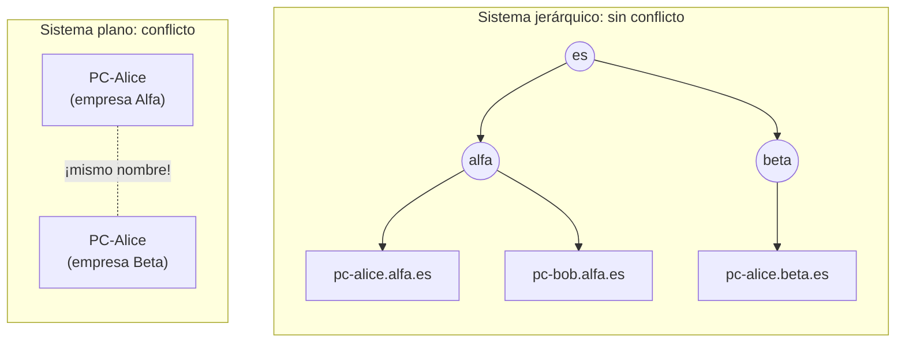
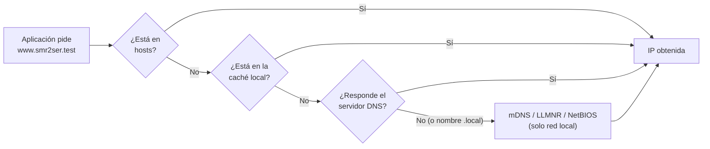
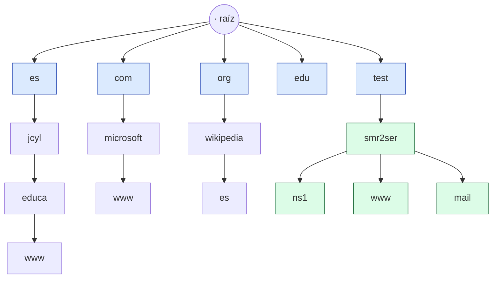
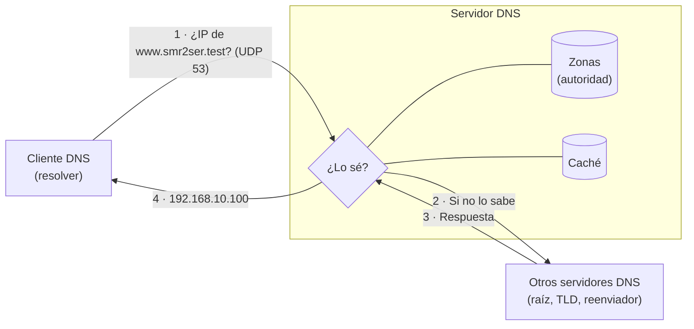
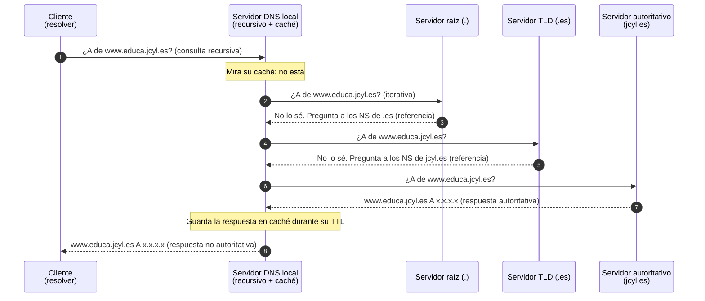
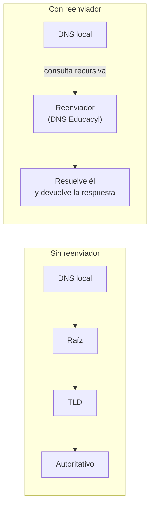
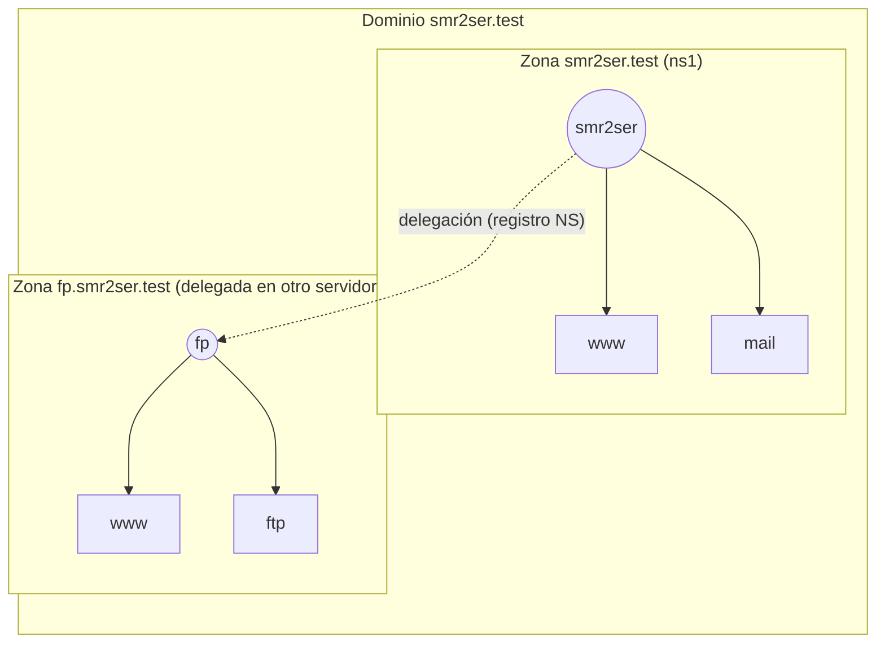
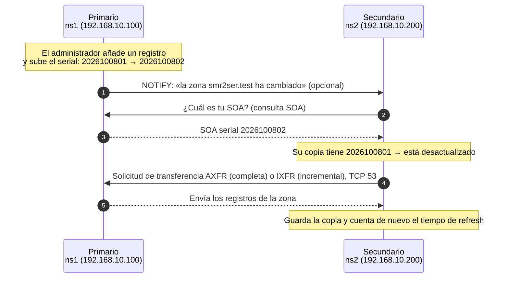
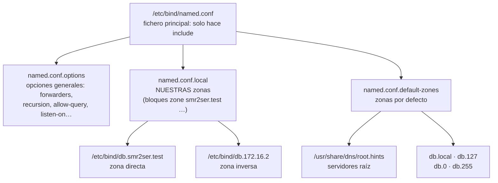

# UT2 · Servicios de resolución de nombres (DNS) — Teoría

> **Módulo:** Servicios en Red · 2º SMR · **RA2:** Instala servicios de resolución de nombres, describiendo sus características y aplicaciones.
> **Criterios que se trabajan en esta página:** RA2.a, RA2.b, RA2.c (y la base teórica de RA2.d – RA2.h).
> [← Volver a la portada de la UT2](index.md)

## Índice

1. [Introducción: ¿por qué necesitamos nombres?](#1-introducción-por-qué-necesitamos-nombres)
2. [Mecanismos de resolución de nombres](#2-mecanismos-de-resolución-de-nombres)
3. [El espacio de nombres de dominio](#3-el-espacio-de-nombres-de-dominio)
4. [Funcionamiento del DNS](#4-funcionamiento-del-dns)
5. [Servidores de nombres: tipos](#5-servidores-de-nombres-tipos)
6. [Zonas y transferencias de zona](#6-zonas-y-transferencias-de-zona)
7. [La base de datos DNS: registros de recursos](#7-la-base-de-datos-dns-registros-de-recursos)
8. [Servidores DNS en sistemas propietarios: Windows Server](#8-servidores-dns-en-sistemas-propietarios-windows-server)
9. [Servidores DNS en sistemas libres: BIND9 en Ubuntu Server](#9-servidores-dns-en-sistemas-libres-bind9-en-ubuntu-server)
10. [Herramientas de comprobación](#10-herramientas-de-comprobación)
11. [Puertos y protocolos](#11-puertos-y-protocolos)
12. [Errores frecuentes](#12-errores-frecuentes)
13. [Preguntas de repaso](#13-preguntas-de-repaso)

> **Dominio de pruebas de esta UT:** `smr2ser.test`. El TLD `.test` está **reservado para pruebas** (RFC 2606 / RFC 6761): nunca existirá en Internet, así que nuestras zonas no chocan con ningún dominio real. En empresas también se usa `.internal`, que ICANN reservó en 2024 para redes privadas.

---

## 1. Introducción: ¿por qué necesitamos nombres?

**DNS** (*Domain Name System*, sistema de nombres de dominio) es el sistema que asigna **nombres** a equipos y servicios de red y los organiza en una **jerarquía de dominios**.

- Las **direcciones IP** son cómodas para las máquinas, pero difíciles de recordar para las personas.
- A las personas nos resulta más sencillo usar nombres: `www.educa.jcyl.es` en lugar de una IP.
- Además, la IP de un servicio puede cambiar (cambio de proveedor, de servidor…). Si los usuarios usan el nombre, basta con actualizar el DNS.

**Escenarios en los que surge la necesidad de un servicio de nombres (RA2.a):**

| Escenario | Problema sin DNS | Qué aporta el DNS |
|---|---|---|
| Navegar por Internet | Habría que saber la IP de cada web | Traduce `www.google.es` → IP |
| Correo electrónico | ¿A qué servidor se entrega el correo de `@smr2ser.test`? | Registro **MX** |
| Red de empresa con muchos equipos | Mantener un fichero `hosts` en cada PC es inviable | Base de datos centralizada |
| Dominio de Active Directory | Los clientes no encontrarían el controlador de dominio | Registros **SRV** |
| Cambio de servidor web | Habría que avisar a todos los usuarios de la nueva IP | Se cambia un registro y listo |
| Varios servicios en la misma máquina | Un solo nombre para todo | Alias (**CNAME**): `www`, `ftp`, `mail`… |

### Ubicación en la arquitectura TCP/IP

| Arquitectura TCP/IP | Modelo OSI | Protocolo | Unidad de datos |
|---|---|---|---|
| Aplicación | Aplicación · Presentación · Sesión | **DNS** | Mensaje DNS |
| Transporte | Transporte | **UDP 53** y **TCP 53** | Datagrama UDP / segmento TCP |
| Internet | Red | IP | Paquete (IP origen y destino) |
| Acceso a red | Enlace · Físico | Ethernet | Trama (MAC origen y destino) · bits |

### Sistemas de nombres planos y jerárquicos

| | Sistema **plano** | Sistema **jerárquico** |
|---|---|---|
| Organización | Nombres sin agrupar, sin jerarquía | Nombres agrupados y clasificados por niveles |
| Unicidad | No puede haber dos nombres iguales en toda la red | Puede repetirse un nombre en ramas distintas |
| Gestión | Centralizada, no escala | Distribuida: cada organización gestiona su rama |
| Ejemplos | DNI, nombres NetBIOS de Windows | Teléfonos (`0034 923 …`), rutas de ficheros (`/home/alumno/docs`), **DNS** |



---

## 2. Mecanismos de resolución de nombres

**Resolver un nombre** es obtener la dirección IP que le corresponde (o al revés). Hay varios mecanismos, y un equipo los consulta **en un orden determinado** (RA2.b):

| Mecanismo | Tipo | Ámbito | Cómo funciona | Dónde se configura |
|---|---|---|---|---|
| **Fichero `hosts`** | Estático, local | Solo ese equipo | Tabla nombre ↔ IP escrita a mano | Linux: `/etc/hosts` · Windows: `C:\Windows\System32\drivers\etc\hosts` |
| **Caché de resolución** | Dinámico, local | Solo ese equipo | Guarda las respuestas recientes durante su TTL | `ipconfig /displaydns` · `resolvectl statistics` |
| **DNS** | Dinámico, distribuido, jerárquico | Internet y redes locales | Pregunta a un servidor DNS (UDP/TCP 53) | IP del servidor DNS en la configuración de red |
| **mDNS** (*multicast DNS*) | Sin servidor, multidifusión | Solo la red local, nombres `.local` | El equipo pregunta a toda la red «¿quién es `pc01.local`?» (UDP 5353) | Avahi (Linux), Bonjour (Apple), Windows 10/11 |
| **LLMNR** | Sin servidor, multidifusión | Solo la red local | Similar a mDNS, de Microsoft (UDP 5355). En desuso | Windows |
| **NetBIOS / WINS** | Plano, heredado | Red local (difusión) o servidor WINS | Nombres de hasta 15 caracteres, sin jerarquía (UDP 137) | Windows antiguos |

**Orden habitual de consulta:**



> En Linux el orden lo decide la línea `hosts:` de `/etc/nsswitch.conf` (por ejemplo, `hosts: files mdns4_minimal [NOTFOUND=return] dns`). En Ubuntu, el DNS lo gestiona **systemd-resolved**, que escucha en `127.0.0.53`; por eso `/etc/resolv.conf` apunta a esa dirección y no al servidor real (se ve con `resolvectl status`).

### Actividad en el aula 1 · Resolución local

Comprueba cómo se resuelve el nombre de tu propio equipo:

```bash
# Linux: el nombre corto suele estar en /etc/hosts
cat /etc/hosts
getent hosts $(hostname)         # usa el mismo orden que las aplicaciones (nsswitch)
ping -c1 -4 $(hostname).local    # nombre .local → se resuelve por mDNS (Avahi)
```

```powershell
# Windows (PowerShell)
ping -4 $env:COMPUTERNAME          # nombre corto → LLMNR / NetBIOS
ping -6 $env:COMPUTERNAME
ping -4 "$env:COMPUTERNAME.local"  # nombre .local → mDNS
```

> ⚠️ Un nombre acabado en **`.local` se resuelve por mDNS**, no por NetBIOS. Por eso **no conviene usar `.local` como dominio DNS** de una red.

---

## 3. El espacio de nombres de dominio

El **espacio de nombres de dominio** es el conjunto de nombres que se pueden usar para identificar máquinas o servicios. Tiene forma de **árbol invertido** (RA2.c):



**Conceptos clave:**

| Concepto | Definición | Ejemplo |
|---|---|---|
| **Nodo raíz** | Parte superior del árbol. Su nombre es nulo (0 caracteres) y se representa con un **punto** | `.` |
| **Etiqueta** | Nombre de cada nodo. Máximo 63 caracteres (letras, números y guiones) | `smr2ser` |
| **Dominio** | Un nodo y todo el subárbol que cuelga de él | `smr2ser.test.` |
| **Subdominio** | Dominio que está dentro de otro | `es.wikipedia.org.` es subdominio de `wikipedia.org.` |
| **FQDN** (*Fully Qualified Domain Name*) | Nombre completo desde el nodo hasta la raíz. **Termina en punto** | `www.smr2ser.test.` |
| **Nombre relativo** | Nombre sin el dominio; se completa con el sufijo DNS configurado | `www` → `www.smr2ser.test.` |

- El nombre completo de un nodo se forma leyendo **de abajo arriba**, separando las etiquetas con **puntos**.
- Un FQDN puede tener como máximo 253 caracteres. En la práctica rara vez se pasan de 4–5 niveles.
- Cada nombre es **único dentro de la jerarquía**.

### Niveles del árbol

| Nivel | Quién lo gestiona | Ejemplos |
|---|---|---|
| **Raíz** | ICANN/IANA. La sirven 13 servidores raíz lógicos (`a.root-servers.net` … `m.root-servers.net`), replicados por todo el mundo | `.` |
| **Primer nivel (TLD)** | Delegado por ICANN a un **operador de registro** | Ver tabla siguiente |
| **Segundo nivel** | Se **compra** a un registrador, vinculado a un TLD | `jcyl.es`, `google.com`, `com.es` |
| **Tercer nivel y siguientes** | **No se compran: los administra** el propietario del dominio de 2º nivel | `educa.jcyl.es`, `www.jcyl.es` |

**Tipos de dominios de primer nivel (TLD):**

| Tipo | Descripción | Ejemplos |
|---|---|---|
| **ccTLD** (geográficos) | Dos letras, un país o territorio | `es`, `fr`, `uk`, `eu` |
| **gTLD** genéricos clásicos | Tres o más letras | `com`, `org`, `net`, `edu`, `gov`, `int`, `mil` |
| **Nuevos gTLD** (desde 2013) | Palabras, ciudades, marcas | `.madrid`, `.barcelona`, `.app`, `.online` |
| **Infraestructura** | Para la resolución inversa | `arpa` (`in-addr.arpa`, `ip6.arpa`) |
| **Reservados** | No existen en Internet | `.test`, `.example`, `.invalid`, `.localhost`, `.internal` |

> Actualizado respecto a los apuntes clásicos: ya no hay «unos 240 TLD». Desde el programa de nuevos gTLD hay **más de 1.400**; la lista oficial está en la [Root Zone Database de IANA](https://www.iana.org/domains/root/db).

- **TLD patrocinado** (*sponsored*): su gestión está delegada en una entidad que representa a una comunidad y fija sus normas (p. ej., `.edu`, `.gov`, `.cat`).
- **TLD no patrocinado**: lo gestiona un operador bajo las políticas generales de ICANN (p. ej., `.com`, `.net`).
- En España, **Red.es** es el operador del ccTLD `.es`.

### Actividad en el aula 2 · Localiza los niveles

Nombres: `www.educa.jcyl.es`, `es.wikipedia.org`, `mail.google.com`, `www.ual.es`, `ns1.smr2ser.test`.

1. Separa cada nombre en etiquetas y léelo **de derecha a izquierda**, empezando por la raíz (`.`).
2. Dibuja **un único árbol** con la raíz arriba y cuelga de él los cinco nombres. Si dos nombres comparten un nodo, no lo repitas.
3. Para cada nombre, indica el TLD, si es un ccTLD o un gTLD y el dominio de 2º nivel.

> Piensa: ¿cuántos nodos `www` y cuántos `es` aparecen en tu árbol? ¿Hay algún conflicto? ¿De qué tipo es el TLD `test`?

---

## 4. Funcionamiento del DNS

El DNS es una **base de datos distribuida**: ningún servidor tiene todos los nombres. Cada servidor guarda solo la parte del árbol de la que es responsable (**tiene autoridad**), y sabe a quién preguntar por el resto.

Sigue el modelo **cliente/servidor**:

- **Cliente DNS (*resolver*)**: pregunta a los servidores de nombres. Lo lleva todo sistema operativo.
- **Servidor de nombres**: responde a partir de su base de datos (zonas) o de su caché, y si no sabe la respuesta **pregunta a otros servidores**. También intercambia zonas con otros servidores (**transferencias de zona**).



### Tipos de consulta

| Tipo | Pregunta | Ejemplo | Necesita |
|---|---|---|---|
| **Directa** | Nombre → IP | ¿IP de `www.educa.jcyl.es`? | Zona de búsqueda directa (registro A/AAAA) |
| **Inversa** | IP → nombre | ¿Nombre de `192.168.10.100`? | Zona de búsqueda inversa (registro PTR) |

### Consultas recursivas e iterativas

- **Recursiva**: el que pregunta exige la **respuesta completa** (o un error). Es la que hace el cliente a su servidor DNS.
- **Iterativa**: el servidor consultado responde con lo que sabe; si no tiene la respuesta, **remite** a otro servidor más cercano a ella. Es la que hace el servidor local a los servidores raíz, TLD, etc.

### Resolución completa paso a paso

Un equipo de la red quiere acceder a `www.educa.jcyl.es` y su caché está vacía:



1. El cliente envía una **consulta recursiva** a su servidor DNS (el que tiene configurado).
2. El servidor local mira su **caché**. Si está, responde directamente (fin).
3. Si no está, pregunta a un **servidor raíz** (los conoce por el fichero de *root hints*).
4. El raíz no sabe la IP, pero **remite** a los servidores del TLD `.es`.
5. El servidor local pregunta al servidor de `.es`.
6. `.es` remite a los servidores con autoridad sobre `jcyl.es`.
7. El servidor local pregunta al **servidor autoritativo** de `jcyl.es`.
8. Este responde con la IP (**respuesta autoritativa**).
9. El servidor local **guarda la respuesta en caché** y se la envía al cliente, que también la guarda en su caché.

> Si alguien repite la consulta antes de que caduque el **TTL**, el servidor local responde desde la caché: en `nslookup` aparecerá **«Respuesta no autoritativa»**. Esto es lo que pide el criterio **RA2.e**: un servidor que almacena las respuestas de servidores públicos y las sirve a la red local.

### Actividad en el aula 3 · nslookup

```text
nslookup www.educa.jcyl.es
nslookup 142.250.184.68
nslookup www.google.com 8.8.8.8
nslookup -type=NS jcyl.es
nslookup -type=MX gmail.com
```

- ¿Qué servidor DNS estás usando en tu máquina? ¿Cómo lo sabes?
- ¿Por qué la respuesta dice «no autoritativa»?
- ¿Qué servidores tienen autoridad sobre `jcyl.es`?
- ¿Qué pasa con la tercera consulta? ¿Funciona desde la red del centro?

---

## 5. Servidores de nombres: tipos

Un **servidor de nombres** es un programa que guarda información de una parte del espacio de nombres y responde a las consultas de clientes y de otros servidores. Por defecto escucha en el **puerto 53 (UDP y TCP)**.

| Tipo | Qué hace | Tiene zonas propias | Ejemplo de uso |
|---|---|---|---|
| **Primario (maestro)** | Tiene la **copia original** de la zona. Los cambios se hacen aquí | Sí (lectura/escritura) | `ns1.smr2ser.test` |
| **Secundario (esclavo)** | Obtiene una **copia de solo lectura** del primario mediante **transferencia de zona** | Sí (copia) | `ns2.smr2ser.test` |
| **Caché** | No tiene autoridad sobre ninguna zona. Resuelve consultas recursivas y **guarda las respuestas** | No | DNS de una red doméstica o de un aula |
| **Reenviador (*forwarder*)** | En lugar de preguntar a los raíz, **reenvía** las consultas que no sabe a otro servidor (p. ej., el del proveedor) | Puede tenerlas | Nuestro servidor reenvía a los DNS de Educacyl |
| **Solo autoritativo** | Responde **solo** por sus zonas; no hace consultas recursivas para nadie | Sí | Servidores públicos de un dominio en Internet |

> Un mismo servidor puede tener varios papeles a la vez: en las prácticas, el servidor será **primario** de `smr2ser.test`, **caché** y **reenviador** hacia los DNS del aula (`10.151.123.21` y `10.151.126.21`).

### Reenviador frente a resolución desde la raíz



En el centro **es obligatorio usar reenviadores**: la red de Educacyl no deja salir consultas DNS directamente a Internet, así que un servidor que intente ir a la raíz no obtendrá respuesta. En casa se pueden usar DNS públicos (p. ej., `8.8.8.8` y `8.8.4.4` de Google, `1.1.1.1` de Cloudflare).

---

## 6. Zonas y transferencias de zona

### Dominio y zona no son lo mismo

- **Dominio**: un subárbol del espacio de nombres (un nodo y todo lo que cuelga de él). Es un concepto **lógico**.
- **Zona**: la parte del espacio de nombres que **administra un servidor concreto**, guardada en un **fichero de zona** (o en Active Directory). Es un concepto **administrativo**.

Si un dominio **delega** un subdominio en otro servidor, ese subdominio deja de estar en su zona:



### Tipos de zona

| Según… | Tipo | Descripción |
|---|---|---|
| **Qué resuelven** | **Búsqueda directa** | Nombre → IP. Se llama como el dominio: `smr2ser.test` |
| | **Búsqueda inversa** | IP → nombre. Se llama con la red **al revés** + `in-addr.arpa`: la red `192.168.10.0/24` es la zona `10.168.192.in-addr.arpa` (en IPv6, `ip6.arpa`) |
| **Su origen** | **Primaria** | Copia original, editable |
| | **Secundaria** | Copia de solo lectura obtenida por transferencia |
| | **De rutas internas** (*stub*) | Solo contiene SOA, NS y las IP de los NS de otra zona; sirve para saber a quién preguntar |
| **Dónde se guarda (Windows)** | **Estándar** | En un fichero `.dns` |
| | **Integrada en Active Directory** | En la base de datos de AD; solo en controladores de dominio |

> ¿Por qué la inversa va al revés? En los nombres DNS lo más general va a la **derecha** (`.es`), y en las IP lo más general va a la **izquierda** (`192.`). Al darle la vuelta, la IP encaja en el árbol: `100.10.168.192.in-addr.arpa.`

### ¿Por qué varios servidores para la misma zona?

¿Qué pasaría si el único servidor con autoridad sobre una zona se estropea? ¿Y si recibe tantas consultas que responde lentamente? Por eso el DNS permite tener **la misma zona en varios servidores** (un primario y uno o más secundarios), lo que proporciona:

- **Tolerancia a fallos**: si cae el primario, los secundarios siguen respondiendo.
- **Reparto de carga**: las consultas se reparten entre servidores.
- **Rapidez**: se pueden colocar servidores cerca de los clientes.

### Transferencia de zona paso a paso

El secundario copia la zona del primario. Para saber si hay cambios, compara el **número de serie** del registro SOA:



1. Si el primario tiene activadas las **notificaciones**, avisa al secundario cuando cambia la zona.
2. Si no hay notificación, el secundario pregunta igualmente cada **refresh** segundos.
3. El secundario pide el **SOA** y compara números de serie.
4. Si el del primario es **mayor**, pide la transferencia: **AXFR** (zona completa) o **IXFR** (solo los cambios). Las transferencias van por **TCP 53**.
5. Si no consigue contactar, reintenta cada **retry** segundos; si pasa el tiempo **expire** sin contactar, deja de responder por esa zona.

> 🔒 **Seguridad:** las transferencias deben permitirse **solo a los servidores secundarios** (en Windows, «Solo a los servidores de la pestaña Servidores de nombres»; en BIND, `allow-transfer { IP; };`). Si cualquiera puede pedir un AXFR, obtiene el listado completo de equipos de la red.

### Actividad en el aula 4 · Juego de rol: la transferencia de zona

Vamos a «ser» servidores DNS. Sin ordenador, con tarjetas de papel.

| Papel | Quién | Qué tiene / qué hace |
|---|---|---|
| **Primario** (`ns1`) | 1 alumno | La zona original: una tarjeta **SOA** con el serial y una tarjeta por registro |
| **Secundarios** (`ns2`, `ns3`) | 2 alumnos | Una copia de la zona. Solo pueden cambiarla copiando la del primario |
| **Administrador** | El profesor | Es el único que modifica la zona del primario |
| **Reloj** | 1 alumno | Anuncia cada «ronda». Los temporizadores del SOA se cuentan en rondas |
| **Clientes** | El resto | Preguntan a cualquier servidor por un nombre y anotan la respuesta |

Temporizadores de nuestra zona: **refresh = 2 rondas · retry = 1 ronda · expire = 4 rondas**.

Reglas:

1. Un secundario **solo** pide la zona si el serial del primario es **mayor** que el suyo.
2. Un secundario pregunta el SOA al primario cuando recibe un **NOTIFY** o cuando se cumple su **refresh**.
3. Si el primario no contesta, el secundario reintenta cada **retry**. Si pasa el **expire** sin contactar, deja de responder.
4. El primario solo entrega la zona a quien esté en su lista de **servidores autorizados**.

Durante el juego, anota en tu cuaderno qué responde cada servidor en cada ronda. Al final responderemos: ¿por qué un cliente recibió una respuesta antigua? ¿Qué pasó con el registro que no llegó a los secundarios?

---

## 7. La base de datos DNS: registros de recursos

La información de cada zona se guarda en **registros de recursos** (*Resource Records*, RR). Todos tienen la misma estructura:

```text
www      3600     IN      A       192.168.10.100
 │         │       │      │             │
 │         │       │      │             └─ Valor (RDATA): depende del tipo
 │         │       │      └─ Tipo de registro
 │         │       └─ Clase: IN = Internet (prácticamente la única que se usa)
 │         └─ TTL: segundos que se puede guardar en caché (opcional; si falta, se usa $TTL)
 └─ Nombre: relativo (se le añade el dominio) o FQDN acabado en punto. @ = el propio dominio
```

La lista oficial de tipos está en los [parámetros DNS de IANA](https://www.iana.org/assignments/dns-parameters/dns-parameters.xhtml). Los que usaremos:

| Tipo | Nombre | Para qué sirve | Ejemplo (fichero de zona) |
|---|---|---|---|
| **SOA** | *Start of Authority* | Primer registro de la zona. Datos generales y temporizadores | ver abajo |
| **NS** | *Name Server* | Servidores con autoridad sobre la zona (y delegaciones) | `@ IN NS ns1.smr2ser.test.` |
| **A** | *Address* | Nombre → IPv4 | `www IN A 192.168.10.100` |
| **AAAA** | *IPv6 address* | Nombre → IPv6 (se llama así porque una IPv6 ocupa 4 veces lo que una IPv4) | `www IN AAAA 2001:db8::100` |
| **CNAME** | *Canonical Name* | Alias de otro nombre | `web IN CNAME www.smr2ser.test.` |
| **MX** | *Mail Exchanger* | Servidor de correo del dominio, con prioridad (menor = preferido) | `@ IN MX 10 mail.smr2ser.test.` |
| **PTR** | *Pointer* | IP → nombre. Solo en zonas inversas | `100 IN PTR win25-ser.smr2ser.test.` |
| **SRV** | *Service* | Equipos que ofrecen un servicio concreto (protocolo, puerto, prioridad, peso) | `_ldap._tcp IN SRV 0 100 389 dc1.smr2ser.test.` |
| **TXT** | *Text* | Texto libre (verificaciones, SPF del correo…) | `@ IN TXT "v=spf1 mx -all"` |

### Registro SOA

```text
@   IN  SOA  ns1.smr2ser.test.  admin.smr2ser.test. (
             2026100801   ; Serial: AAAAMMDDnn. Hay que SUBIRLO en cada cambio
             3600         ; Refresh: cada cuánto pregunta el secundario si hay cambios (1 h)
             900          ; Retry: si falla, cada cuánto reintenta (15 min)
             604800       ; Expire: si no contacta en este tiempo, deja de responder (7 días)
             3600 )       ; TTL negativo: cuánto se guarda en caché un «ese nombre no existe» (1 h)
```

| Campo | Significado |
|---|---|
| **MNAME** (`ns1.smr2ser.test.`) | FQDN del servidor **primario** de la zona |
| **RNAME** (`admin.smr2ser.test.`) | Correo del responsable, con un **punto en lugar de la @** → `admin@smr2ser.test` |
| **Serial** | Número de versión de la zona. Si no aumenta, los secundarios **no** copian los cambios |
| **Refresh / Retry / Expire** | Temporizadores de los secundarios (ver transferencia de zona) |
| **TTL negativo** (*minimum*) | Tiempo que se cachean las respuestas negativas (NXDOMAIN) |

> En Windows Server los valores por defecto del SOA son: actualización 15 min, reintento 10 min, expira 1 día y TTL mínimo 1 h. Se cambian en *Propiedades de la zona → Inicio de autoridad (SOA)*.

### Reglas de los registros que más fallan

- **NS**: toda zona tiene **al menos un** NS. Si el NS está dentro de la propia zona (`ns1.smr2ser.test`), tiene que existir también su **registro A**.
- **CNAME**: el nombre canónico (oficial) de una máquina lo da su registro **A**, que es único. Los CNAME son alias. Un nombre con CNAME **no puede tener ningún otro registro**, y en el `@` de la zona no se puede poner un CNAME (ahí ya están el SOA y los NS).
- **MX** y **NS** deben apuntar a un nombre con registro **A/AAAA**, **nunca a un CNAME** ni a una IP.
- **PTR**: una zona inversa es IPv4 **o** IPv6, no ambas (`in-addr.arpa` y `ip6.arpa` son ramas distintas).

### Fichero de zona completo de ejemplo

Así queda la zona `smr2ser.test` del escenario de la práctica de Windows (red `net01`, `192.168.10.0/24`) escrita en formato estándar (RFC 1035), el mismo que usan BIND y los ficheros `.dns` de Windows:

```text
$TTL 86400                          ; TTL por defecto de los registros: 1 día
$ORIGIN smr2ser.test.               ; dominio que se añade a los nombres relativos

@         IN  SOA   ns1.smr2ser.test. admin.smr2ser.test. (
                    2026100801 3600 900 604800 3600 )

; --- Servidores de nombres y correo ---
@         IN  NS    ns1.smr2ser.test.
@         IN  NS    ns2.smr2ser.test.
@         IN  MX    10 mail.smr2ser.test.

; --- Equipos (registros A) ---
ns1       IN  A     192.168.10.100
ns2       IN  A     192.168.10.200
win25-ser IN  A     192.168.10.100
mail      IN  A     192.168.10.100
www       IN  A     192.168.10.100
router    IN  A     192.168.10.254
debiancli IN  A     192.168.10.150

; --- Alias ---
web       IN  CNAME www.smr2ser.test.
ftp       IN  CNAME win25-ser
```

Y su zona inversa, `10.168.192.in-addr.arpa`:

```text
$TTL 86400
@    IN  SOA  ns1.smr2ser.test. admin.smr2ser.test. (
              2026100801 3600 900 604800 3600 )
@    IN  NS   ns1.smr2ser.test.
@    IN  NS   ns2.smr2ser.test.

100  IN  PTR  win25-ser.smr2ser.test.   ; 192.168.10.100
200  IN  PTR  ns2.smr2ser.test.         ; 192.168.10.200
150  IN  PTR  debiancli.smr2ser.test.   ; 192.168.10.150
254  IN  PTR  router.smr2ser.test.      ; 192.168.10.254
```

> ⚠️ Fíjate en el **punto final**: `www.smr2ser.test.` es un FQDN; sin el punto, el servidor le añadiría el dominio y quedaría `www.smr2ser.test.smr2ser.test.`

### Actividad en el aula 5 · Arregla el fichero de zona

La empresa (ficticia) **Jamones Guijuelo** tiene la red `10.10.20.0/24` y quiere este DNS:

| Equipo | IP | Funciones |
|---|---|---|
| `servidor` | `10.10.20.10` | DNS primario (`ns1`), correo (`correo`) e intranet (`intranet`) |
| `copia` | `10.10.20.11` | DNS secundario (`ns2`) y servidor FTP (`ftp`) |
| `www` | `10.10.20.30` | Web de la empresa. También debe abrirse escribiendo solo `jamones-guijuelo.test` |
| `impresora` | `10.10.20.25` | Impresora de red |

Ayer la zona tenía el serial `2026101501`. Hoy el administrador ha añadido `intranet`, `ftp` y la impresora, y ha dejado el fichero así:

```text
$TTL 86400
@         IN  SOA    ns1.jamones-guijuelo.test  admin@jamones-guijuelo.test. (
                     2026101501  ; serial
                     3600        ; refresh
                     900         ; retry
                     604800      ; expire
                     3600 )      ; TTL negativo

@         IN  NS     ns1.jamones-guijuelo.test.
@         IN  NS     ns2.jamones-guijuelo.test.
@         IN  MX     10 correo.jamones-guijuelo.test.
@         IN  CNAME  www.jamones-guijuelo.test.

ns1       IN  A      10.10.20.10
servidor  IN  A      10.10.20.10
copia     IN  A      10.10.20.11
www       IN  A      10.10.20.300
impresora IN  A      10.10.20.25

correo    IN  CNAME  servidor.jamones-guijuelo.test.
intranet  IN  CNAME  10.10.20.10
ftp       IN  CNAME  copia.jamones-guijuelo.test.
ftp       IN  A      10.10.20.11
25        IN  PTR    impresora.jamones-guijuelo.test.
```

1. Encuentra los **10 errores**. Para cada uno, indica la línea, qué está mal y qué regla incumple.
2. Escribe el fichero corregido.
3. **Ampliación:** escribe también la zona inversa `20.10.10.in-addr.arpa` con los PTR de todos los equipos.

> En las prácticas comprobarás este tipo de errores con `named-checkzone`, que revisa un fichero de zona antes de cargarlo.

---

## 8. Servidores DNS en sistemas propietarios: Windows Server

En Windows Server 2025 el servidor DNS es un **rol**: *Administrador del servidor → Agregar roles y características → Servidor DNS*. Una vez instalado, se gestiona con la consola **Administrador de DNS** (*Herramientas → DNS*) o con PowerShell.

| Elemento | En Windows Server |
|---|---|
| Instalación | Rol **Servidor DNS** · `Install-WindowsFeature DNS -IncludeManagementTools` |
| Consola | `dnsmgmt.msc` (Administrador de DNS) |
| Ficheros de zona | `C:\Windows\System32\dns\<zona>.dns` (zonas estándar) |
| *Root hints* | `C:\Windows\System32\dns\cache.dns` |
| Caché del servidor | En memoria · se borra con *Borrar caché* o `Clear-DnsServerCache` |
| Reenviadores | *Propiedades del servidor → Reenviadores* · `Set-DnsServerForwarder` |
| Transferencias | *Propiedades de la zona → Transferencias de zona* |
| Ver/borrar caché del cliente | `ipconfig /displaydns` · `ipconfig /flushdns` |

> ⚠️ A pesar de su nombre, **`cache.dns` no es la caché del servidor**: contiene las *root hints* (nombres e IP de los 13 servidores raíz), que el servidor usa para empezar a resolver cuando no tiene reenviadores. La caché real está en memoria.

> Los cambios hechos en la consola se guardan en el fichero `.dns` al usar **Acción → Actualizar archivo de datos del servidor** (o al cabo de un rato, de forma automática).

Los pasos detallados (zona directa e inversa, registros A, MX y CNAME, reenviadores y zona secundaria) están en la [práctica de Windows Server](practica-windows.md).

---

## 9. Servidores DNS en sistemas libres: BIND9 en Ubuntu Server

**BIND** (*Berkeley Internet Name Domain*, [bind9.net](https://bind9.net/)) es el servidor DNS de código abierto más extendido. Lo mantiene el ISC. En Ubuntu Server 24.04 LTS se instala con:

```bash
sudo apt update
sudo apt install bind9 bind9-utils bind9-dnsutils
```

> En Ubuntu 24.04 se instala la rama **9.18** de BIND. El servicio de systemd se llama **`named`** (`bind9` es un alias): `systemctl status named`.

**Estructura de ficheros** (`/etc/bind/`):



| Fichero | Contenido |
|---|---|
| `/etc/bind/named.conf` | Fichero principal. Solo incluye a los otros tres. **No se edita** |
| `/etc/bind/named.conf.options` | Opciones generales del servidor (reenviadores, quién puede consultar, recursión…) |
| `/etc/bind/named.conf.local` | Declaración de **nuestras zonas** (tipo, fichero, a quién se permite transferir) |
| `/etc/bind/named.conf.default-zones` | Zonas que BIND trae creadas |
| `/usr/share/dns/root.hints` | Servidores raíz (antes era `/etc/bind/db.root`) |
| `/etc/bind/db.local` · `db.127` | Resolución directa e inversa de `localhost` (127.0.0.1) |
| `/etc/bind/db.0` · `db.255` | Zonas inversas de las direcciones 0.x y 255.x (evitan consultas inútiles a Internet) |
| `/var/cache/bind/` · `/var/lib/bind/` | Directorios donde `named` **puede escribir**: aquí van las copias de las zonas **secundarias** |

**Comportamiento por defecto:** recién instalado, BIND ya funciona como **servidor caché** recursivo para la propia red (redes de sus interfaces). Para que pregunte a los DNS del aula en lugar de ir a la raíz, basta con añadir los **`forwarders`** en `named.conf.options`.

**Herramientas que no pueden faltar:**

| Comando | Para qué |
|---|---|
| `sudo named-checkconf` | Comprueba la sintaxis de `named.conf` y sus include. Si no dice nada, está bien |
| `sudo named-checkzone smr2ser.test /etc/bind/db.smr2ser.test` | Comprueba un fichero de zona. Debe terminar en `OK` |
| `sudo systemctl restart named` · `sudo rndc reload` | Aplica los cambios |
| `sudo journalctl -u named` | Registro del servicio: errores al cargar zonas, transferencias… |
| `sudo ss -tulpn \| grep :53` | Comprueba que `named` escucha en UDP y TCP 53 |

Los ficheros completos y comentados (opciones, zonas, primario y secundario) estarán en la [práctica de Ubuntu Server](practica-ubuntu.md).

---

## 10. Herramientas de comprobación

| Herramienta | Sistema | Ejemplo | Qué muestra |
|---|---|---|---|
| `nslookup` | Windows y Linux | `nslookup www.smr2ser.test 192.168.10.100` | Respuesta y servidor que contesta |
| `dig` | Linux (paquete `bind9-dnsutils`) | `dig @172.16.2.1 smr2ser.test SOA` | Respuesta completa: secciones, TTL, flag `aa` |
| `dig -x` | Linux | `dig -x 192.168.10.100` | Resolución inversa (PTR) |
| `dig +trace` | Linux | `dig +trace www.educa.jcyl.es` | Toda la cadena raíz → TLD → autoritativo |
| `dig AXFR` | Linux | `dig @192.168.10.100 smr2ser.test AXFR` | Transferencia de zona (si está permitida) |
| `host` | Linux | `host -t MX smr2ser.test` | Respuesta resumida |
| `Resolve-DnsName` | PowerShell | `Resolve-DnsName smr2ser.test -Type MX -Server 192.168.10.100` | Equivalente a `dig` en Windows |
| `resolvectl` | Ubuntu (systemd-resolved) | `resolvectl status` · `resolvectl flush-caches` | DNS configurados en cada interfaz · borrar caché |
| `ipconfig` | Windows | `ipconfig /all` · `/displaydns` · `/flushdns` | DNS configurado · caché del cliente |

**Cómo leer `dig`:**

```text
;; ->>HEADER<<- opcode: QUERY, status: NOERROR, id: 4242
;; flags: qr aa rd ra; QUERY: 1, ANSWER: 1, AUTHORITY: 0, ADDITIONAL: 1

;; ANSWER SECTION:
www.smr2ser.test.   86400   IN   A   192.168.10.100

;; SERVER: 192.168.10.100#53(192.168.10.100) (UDP)
```

- **status**: `NOERROR` (correcto), `NXDOMAIN` (el nombre no existe), `SERVFAIL` (el servidor falló, p. ej. zona mal cargada), `REFUSED` (no te deja consultar).
- **flags**: `aa` = respuesta **autoritativa**; `ra` = el servidor admite recursión; `rd` = el cliente pidió recursión.
- **SERVER**: qué servidor ha respondido. Comprueba que es el tuyo y no otro.

---

## 11. Puertos y protocolos

| Protocolo / servicio | Puerto | Transporte | Uso |
|---|---|---|---|
| **DNS** (consultas) | **53** | **UDP** | Consultas y respuestas normales |
| **DNS** (transferencias y respuestas grandes) | **53** | **TCP** | AXFR/IXFR y respuestas que no caben en UDP |
| DNS sobre TLS (DoT) | 853 | TCP | Consultas cifradas |
| DNS sobre HTTPS (DoH) | 443 | TCP (HTTPS) | Consultas cifradas dentro de HTTPS (navegadores) |
| mDNS | 5353 | UDP (multicast `224.0.0.251`) | Nombres `.local` en la red local |
| LLMNR | 5355 | UDP (multicast) | Resolución local en Windows |
| NetBIOS Name Service | 137 | UDP | Nombres NetBIOS / WINS |
| rndc (control de BIND) | 953 | TCP (solo `127.0.0.1`) | Administración local de `named` |

> 🔥 Si hay cortafuegos, hay que abrir **UDP y TCP 53**. Con solo UDP, las consultas funcionan pero **las transferencias de zona fallan**.

---

## 12. Errores frecuentes

| Error | Síntoma | Solución |
|---|---|---|
| Olvidar el **punto final** en un FQDN dentro del fichero de zona | Los registros apuntan a `www.smr2ser.test.smr2ser.test.` | Escribir `www.smr2ser.test.` o el nombre relativo `www` |
| **No subir el número de serie** del SOA tras un cambio | El secundario no se actualiza | Incrementar el serial (formato `AAAAMMDDnn`) y recargar |
| Poner una **@** en el correo del SOA | Error de sintaxis o correo mal interpretado | `admin.smr2ser.test.` (punto en lugar de @) |
| NS o MX sin **registro A**, o apuntando a un **CNAME** | `named-checkzone` avisa; el correo no se entrega | Crear el A de `ns1`, `mail`, etc. |
| Crear un registro A con «Crear PTR asociado» **sin zona inversa** | Windows avisa de que no puede crear el PTR | Crear primero la zona inversa, o desmarcar la opción |
| El cliente sigue usando **otro DNS** (el del aula, el del DHCP…) | `nslookup` responde un servidor que no es el nuestro | Poner nuestra IP como **primer** DNS en el cliente y en la opción 006/`domain-name-servers` del DHCP |
| Respuestas antiguas tras corregir un registro | El cambio «no se ve» | Borrar la caché del servidor y del cliente: `ipconfig /flushdns`, `resolvectl flush-caches`, `rndc flush` |
| Servidor sin **reenviadores** en la red del centro | Resuelve nuestra zona, pero no Internet | Añadir `10.151.123.21` y `10.151.126.21` como reenviadores |
| Transferencias **permitidas a cualquiera** | Cualquiera obtiene la zona con `dig AXFR` | Limitarlas a los NS secundarios |
| Zona secundaria de BIND guardada en `/etc/bind` | `permission denied` en `journalctl -u named` | Guardarla en `/var/lib/bind/` o `/var/cache/bind/` |
| Usar `.local` o un dominio real (`.com`, `.org`) en el laboratorio | Conflictos con mDNS o con el dominio real de Internet | Usar `.test` o `.internal` |
| Confundir `cache.dns` con la caché de Windows | Se «borra la caché» editando el fichero | `cache.dns` son las *root hints*; la caché se borra desde la consola o con `Clear-DnsServerCache` |

---

## 13. Preguntas de repaso

1. Describe dos escenarios en los que sea imprescindible un servicio de resolución de nombres y explica qué problema resuelve en cada uno. *(RA2.a)*
2. ¿Qué diferencia hay entre un sistema de nombres plano y uno jerárquico? Pon un ejemplo de cada uno. *(RA2.b, RA2.c)*
3. Ordena los mecanismos que usa un equipo Linux para resolver `www.smr2ser.test` y di dónde se configura ese orden. *(RA2.b)*
4. ¿Por qué un nombre acabado en `.local` no debería usarse como dominio DNS?
5. Escribe el FQDN del servidor web de la Junta de Castilla y León e identifica la raíz, el TLD, el dominio de 2º nivel y el nombre del equipo. *(RA2.c)*
6. ¿Qué diferencia hay entre una consulta recursiva y una iterativa? ¿Quién hace cada una?
7. Explica, paso a paso, qué ocurre cuando un cliente con la caché vacía pregunta por `www.educa.jcyl.es`.
8. ¿Qué significa que una respuesta sea «no autoritativa»? ¿Cuándo aparece?
9. ¿Qué diferencia hay entre un servidor caché y un reenviador? ¿Por qué en el centro necesitamos reenviadores? *(RA2.e)*
10. ¿Qué diferencia hay entre dominio y zona?
11. Escribe el nombre de la zona inversa de la red `172.16.2.0/24` y el registro PTR de la IP `172.16.2.1`, cuyo nombre es `ubuntuserver24.smr2ser.test`.
12. ¿Para qué sirve el número de serie del SOA? ¿Qué pasa si lo olvidas al modificar la zona?
13. Escribe los registros necesarios para que el correo de `smr2ser.test` se entregue a `mail.smr2ser.test` (`192.168.10.100`) y para que `web.smr2ser.test` sea un alias de `www`. *(RA2.f)*
14. ¿Qué tres ventajas aporta tener un servidor secundario? ¿Qué protocolo y puerto usa la transferencia de zona? *(RA2.g)*
15. ¿Por qué hay que limitar las transferencias de zona?
16. En la salida de `dig`, ¿qué indican el flag `aa` y el estado `NXDOMAIN`? *(RA2.h)*
17. ¿Qué contiene realmente el fichero `cache.dns` de Windows Server?
18. ¿Qué hace cada uno de estos ficheros de BIND: `named.conf.options`, `named.conf.local` y `db.smr2ser.test`?

---

**Siguiente:** [Práctica · DNS en Windows Server](practica-windows.md) · [Práctica · DNS en Ubuntu Server (BIND9)](practica-ubuntu.md)